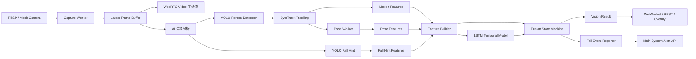

# Vision Service 部署复现文档

更新日期：2026-07-01  
项目路径示例：`D:\Program\vision_service`  
服务类型：实时跌倒检测视觉服务

本文档用于帮助后续工作人员快速完成项目搭建、模型文件恢复、运行配置、启动验证和主系统对接。  
如果只想恢复当前机器上的完整状态，优先使用本地备份包：

```powershell
D:\Program\vision_service-6-30.zip
```

如果从 GitHub 或 Git bundle 重新部署，则需要额外恢复 `.env` 和模型权重文件，因为这些文件通常不会上传到公开仓库。

## 1. 当前系统能力

当前系统目标是接收摄像头视频流，实时输出视频画面和检测 overlay，并在确认跌倒后向主系统推送分级告警。

当前运行链路：



核心原则：

- 视频主通道不等待 AI 推理，优先保证实时流畅。
- AI 只处理最新帧，不堆积旧帧。
- YOLO Fall Hint 只作为候选证据，不允许单独触发 confirmed 告警。
- 最终告警由 LSTM、姿态、框运动、fall hint 和融合状态机共同确认。
- 主系统只接收 confirmed fall 事件，不接收连续视频流。

## 2. 推荐环境

### 2.1 操作系统

推荐环境：

```text
Windows 10 / Windows 11
PowerShell
Anaconda 或 Miniconda
Python 3.10
NVIDIA GPU + CUDA 可选
```

CPU 也可以运行，但实时性和模型延迟会明显变差。正式演示或部署建议使用 NVIDIA GPU。

### 2.2 网络要求

如果使用真实摄像头：

- 视觉服务机器必须能访问摄像头 RTSP 地址。
- 如果需要向主系统弹窗告警，视觉服务机器必须能访问主系统后端地址。
- 主系统也必须能访问视觉服务暴露的截图 URL，例如 `http://<vision-service-ip>:8000/fall-events/snapshots/...`。

如果当前不在同一网络，可先使用 mock camera 或本地测试视频完成服务启动和接口验证。

## 3. 获取代码

### 3.1 从 GitHub 获取

```powershell
cd D:\Program
git clone https://github.com/kangzhouyang/69-service-.git vision_service
cd D:\Program\vision_service
git checkout feature/pose-model-qualification
```

如果需要切到已知回退节点：

```powershell
git fetch --tags
git checkout checkpoint-realtime-fall-pipeline-20260630
```

注意：截至 2026-07-01，本地记录显示当前分支曾出现 `ahead 1`，远程 GitHub 可能不是最新本地版本。如果 GitHub 版本缺失最近提交，应使用本地 Git bundle 或 zip 备份恢复。

### 3.2 从本地 Git bundle 恢复

本地 bundle 路径：

```powershell
D:\Program\vision_service\backups\vision_service_checkpoint_realtime_fall_pipeline_20260630.bundle
```

恢复命令：

```powershell
cd D:\Program
git clone D:\Program\vision_service\backups\vision_service_checkpoint_realtime_fall_pipeline_20260630.bundle vision_service_from_bundle
cd D:\Program\vision_service_from_bundle
git checkout feature/pose-model-qualification
```

### 3.3 从 zip 备份恢复

本地完整备份：

```powershell
D:\Program\vision_service-6-30.zip
```

恢复命令：

```powershell
Expand-Archive -Path D:\Program\vision_service-6-30.zip -DestinationPath D:\Program\vision_service-6-30-restored
cd D:\Program\vision_service-6-30-restored\vision_service
```

这个 zip 包包含 `.env` 和模型权重，适合本机完整回档。不要把该 zip 上传到公开 GitHub，因为 `.env` 可能包含摄像头账号、密码、内网地址或 token。

## 4. 创建 Python 环境

推荐使用 Conda：

```powershell
conda create -n vision_service python=3.10 -y
conda activate vision_service
python -m pip install --upgrade pip
pip install -r requirements.txt
```

如果使用已有 Anaconda Python，也可以直接执行：

```powershell
cd D:\Program\vision_service
D:\Anaconda\python.exe -m pip install -r requirements.txt
```

可选身份识别依赖：

```powershell
pip install -r requirements-identity.txt
```

当前默认 `ENABLE_IDENTITY=false`，不启用身份识别时不需要安装该可选依赖。

## 5. GPU / CUDA 说明

Ultralytics YOLO 会通过 PyTorch 使用 GPU。确认 GPU 是否可用：

```powershell
python - <<'PY'
import torch
print("torch:", torch.__version__)
print("cuda available:", torch.cuda.is_available())
print("device:", torch.cuda.get_device_name(0) if torch.cuda.is_available() else "CPU")
PY
```

如果 `cuda available` 是 `False`，服务仍可启动，但建议在 `.env` 中先保持设备字段为空，让框架自动选择：

```env
YOLO_DEVICE=
YOLO_FALL_DEVICE=
YOLO11_POSE_DEVICE=
RTMPOSE_DEVICE=
```

如果确认 GPU 可用，可按实际环境设置：

```env
YOLO_DEVICE=0
YOLO_FALL_DEVICE=0
YOLO11_POSE_DEVICE=0
```

## 6. 恢复模型文件

公开 Git 仓库通常不会包含 `.pt`、`.pth`、`.onnx`、`.zip` 等大文件，因为 `.gitignore` 已排除这些权重文件。复现时必须确认以下文件存在。

### 6.1 当前推荐运行模型

```text
D:\Program\vision_service\yolov8n.pt
D:\Program\vision_service\models\yolo_fall_hint_v2_plus_b012_best.pt
D:\Program\vision_service\models\pose_yolo_batch001_003_yolo11s_best.pt
D:\Program\vision_service\models\fall_lstm_v5.onnx
D:\Program\vision_service\models\fall_lstm_v5_features.json
```

对应职责：

| 模型 | 当前用途 | 默认配置字段 |
|---|---|---|
| `yolov8n.pt` | 人体检测 YOLO Person | `YOLO_MODEL_PATH` |
| `models/yolo_fall_hint_v2_plus_b012_best.pt` | 跌倒候选提示 YOLO Fall Hint | `YOLO_FALL_MODEL_PATH` |
| `models/pose_yolo_batch001_003_yolo11s_best.pt` | 姿态检测 / 姿态证据 | `YOLO11_POSE_MODEL_PATH` |
| `models/fall_lstm_v5.onnx` | 时序跌倒判断 LSTM | `TEMPORAL_ONNX_MODEL_PATH` |
| `models/fall_lstm_v5_features.json` | LSTM 特征 schema | `TEMPORAL_FEATURE_SCHEMA_PATH` |

### 6.2 文件不存在时的处理

如果模型文件缺失：

1. 优先从 `D:\Program\vision_service-6-30.zip` 恢复。
2. 或从原机器 `D:\Program\vision_service\models\` 拷贝。
3. 或重新下载/训练模型后放到同名路径。

验证文件是否存在：

```powershell
Test-Path D:\Program\vision_service\models\yolo_fall_hint_v2_plus_b012_best.pt
Test-Path D:\Program\vision_service\models\pose_yolo_batch001_003_yolo11s_best.pt
Test-Path D:\Program\vision_service\models\fall_lstm_v5.onnx
```

## 7. 配置 `.env`

项目启动时会自动读取：

```text
D:\Program\vision_service\.env
```

如果没有 `.env`，先复制模板：

```powershell
cd D:\Program\vision_service
Copy-Item .env.example .env
```

### 7.1 本地 mock camera 快速启动

没有真实摄像头时，使用 mock camera：

```env
DEFAULT_CAMERA_ID=camera_01
DEFAULT_RTSP_URL=
MOCK_CAMERA_ENABLED=true
```

### 7.2 真实 RTSP 摄像头

将 `DEFAULT_RTSP_URL` 改为真实 RTSP 地址，并关闭 mock：

```env
DEFAULT_CAMERA_ID=camera_01
DEFAULT_RTSP_URL=rtsp://<user>:<password>@<camera-ip>:<port>/<path>
MOCK_CAMERA_ENABLED=false
```

不要把包含真实账号密码的 `.env` 提交到 GitHub。

### 7.3 当前推荐 AI 链路配置

当前系统推荐配置：

```env
DETECTION_ENABLED=true
YOLO_MODEL_PATH=yolov8n.pt
YOLO_CONFIDENCE=0.35
DETECTION_INTERVAL_MS=100

FALL_DETECTOR_ENABLED=true
YOLO_FALL_MODEL_PATH=models/yolo_fall_hint_v2_plus_b012_best.pt
YOLO_FALL_CONFIDENCE=0.25
FALL_DETECTOR_INTERVAL_MS=200

ENABLE_TRACKING=true

ENABLE_POSE=true
POSE_PROVIDER=yolo11_legacy
YOLO11_POSE_MODEL_PATH=models/pose_yolo_batch001_003_yolo11s_best.pt
POSE_WORKER_FPS=3

ENABLE_TEMPORAL=true
TEMPORAL_MODEL_PROVIDER=onnx_lstm
TEMPORAL_ONNX_MODEL_PATH=models/fall_lstm_v5.onnx
TEMPORAL_FEATURE_SCHEMA_PATH=models/fall_lstm_v5_features.json

TRACKING_WORKER_FPS=20
RESULT_PUBLISH_FPS=20
WEBRTC_VIDEO_FPS=25
```

说明：

- 当前新训练的人体检测 person 模型尚未作为默认运行模型接入，默认仍是 `YOLO_MODEL_PATH=yolov8n.pt`。
- 当前 Fall Hint 模型已经接入为 `models/yolo_fall_hint_v2_plus_b012_best.pt`。
- 当前 pose 运行路径使用 `yolo11_legacy`，模型为 `models/pose_yolo_batch001_003_yolo11s_best.pt`。
- 当前时序模型使用 ONNX LSTM：`models/fall_lstm_v5.onnx`。

### 7.4 摄像头稳定性配置

当前推荐使用隔离式采集后端，降低 RTSP 阻塞对主服务的影响：

```env
CAPTURE_BACKEND=subprocess_opencv
STREAM_STALE_THRESHOLD_MS=3000
STREAM_STALE_RECONNECT_AFTER_MS=6000
CAPTURE_PROCESS_FRAME_TIMEOUT_MS=2000
CAPTURE_PROCESS_RESTART_MS=500
CAPTURE_IPC_MODE=jpeg_pipe
CAPTURE_JPEG_QUALITY=60
CAPTURE_PROCESS_OUTPUT_HEIGHT=720
CAPTURE_PROCESS_WRITE_FPS=10
```

如果部署机器不稳定，优先检查 `/status` 中的：

- `camera.stream_state`
- `camera.frame_age_ms`
- `camera.capture_fps`
- `camera.capture_process_alive`
- `camera.capture_process_last_error`

### 7.5 主系统告警对接

如果暂时不对接主系统：

```env
MAIN_SYSTEM_ALERT_ENABLED=false
MAIN_SYSTEM_REPORT_DRY_RUN=true
```

如果需要正式向主系统推送告警：

```env
MAIN_SYSTEM_ALERT_ENABLED=true
MAIN_SYSTEM_REPORT_DRY_RUN=false
MAIN_SYSTEM_BASE_URL=http://<main-system-ip>:8000/api/v1
MAIN_SYSTEM_FALL_EVENT_PATH=/video-bridge/fall-events
MAIN_SYSTEM_ALERT_TIMEOUT_MS=2500
MAIN_SYSTEM_ALERT_COOLDOWN_SECONDS=90
VISION_SERVICE_PUBLIC_BASE_URL=http://<vision-service-ip>:8000
```

如果主系统需要 token：

```env
MAIN_SYSTEM_ALERT_TOKEN=<token>
MAIN_SYSTEM_ALERT_TOKEN_HEADER=X-Vision-Service-Token
```

## 8. 启动服务

进入项目目录：

```powershell
cd D:\Program\vision_service
conda activate vision_service
```

启动：

```powershell
python -m uvicorn app.main:app --host 0.0.0.0 --port 8000
```

如果使用指定 Anaconda Python：

```powershell
D:\Anaconda\python.exe -m uvicorn app.main:app --host 0.0.0.0 --port 8000
```

启动成功后访问：

```text
http://127.0.0.1:8000/healthz
http://127.0.0.1:8000/status
http://127.0.0.1:8000/demo
```

## 9. 启动或切换视频流

### 9.1 使用默认 `.env` 流

如果 `.env` 中已经设置 `DEFAULT_RTSP_URL`，服务启动时会自动拉流。

查看当前流状态：

```powershell
Invoke-RestMethod "http://127.0.0.1:8000/stream/source?camera_id=camera_01"
```

### 9.2 运行时启动 RTSP

```powershell
$body = @{
  camera_id = "camera_01"
  rtsp_url = "rtsp://<user>:<password>@<camera-ip>:<port>/<path>"
} | ConvertTo-Json

Invoke-RestMethod "http://127.0.0.1:8000/stream/start" `
  -Method POST `
  -ContentType "application/json" `
  -Body $body
```

### 9.3 探测摄像头端口

```powershell
$body = @{
  host = "<camera-ip>"
  port = 554
  timeout_ms = 1500
} | ConvertTo-Json

Invoke-RestMethod "http://127.0.0.1:8000/stream/probe" `
  -Method POST `
  -ContentType "application/json" `
  -Body $body
```

## 10. 前端访问

内置演示页面：

```text
http://127.0.0.1:8000/demo
```

局域网访问时使用视觉服务机器 IP：

```text
http://<vision-service-ip>:8000/demo
```

前端实时画面来自 WebRTC，检测框和告警状态来自 WebSocket / REST 结果。  
如果视频正常但框不显示，重点检查 `/status` 中 detection、tracking、pose、temporal、pipeline 的状态。

## 11. 验证接口

### 11.1 健康检查

```powershell
Invoke-RestMethod http://127.0.0.1:8000/healthz
```

期望：

```json
{"status":"ok"}
```

### 11.2 系统状态

```powershell
Invoke-RestMethod "http://127.0.0.1:8000/status?camera_id=camera_01"
```

重点检查：

```text
camera.running = true
camera.stream_state = connected
camera.frame_age_ms 不持续升高
detection.loaded = true
detection.detection_fps > 0
detection.fall_hint_fps > 0
tracking.tracking_fps > 0
pose.pose_enabled = true
temporal.enabled = true
pipeline.result_publish_fps > 0
```

### 11.3 最新识别结果

```powershell
Invoke-RestMethod "http://127.0.0.1:8000/integration/results/camera_01/latest"
```

如果刚启动还没有结果，可能返回：

```text
VISION_RESULT_NOT_READY
```

等待几秒后再请求。

### 11.4 告警轮询接口

主系统前端如果采用轮询方式，可请求：

```powershell
Invoke-RestMethod "http://127.0.0.1:8000/integration/fall-alerts/camera_01/poll"
```

返回中重点字段：

```text
should_popup
incident_id
fall_state
risk_level
snapshot_url
```

### 11.5 截图接口

```text
http://127.0.0.1:8000/stream/latest-frame.jpg?camera_id=camera_01
```

确认该接口能返回最新帧，有助于判断摄像头采集是否正常。

## 12. 主系统对接验证

### 12.1 查看当前告警配置

```powershell
Invoke-RestMethod http://127.0.0.1:8000/alerting/status
```

### 12.2 运行时修改告警目标

```powershell
$body = @{
  base_url = "http://<main-system-ip>:8000/api/v1"
  path = "/video-bridge/fall-events"
  enabled = $true
} | ConvertTo-Json

Invoke-RestMethod "http://127.0.0.1:8000/alerting/endpoint" `
  -Method POST `
  -ContentType "application/json" `
  -Body $body
```

### 12.3 发送一次模拟告警

```powershell
$body = @{
  target_ip = "<main-system-ip>"
  camera_id = "camera_01"
  track_id = "manual-console-probe"
  fall_prob = 0.91
} | ConvertTo-Json

Invoke-RestMethod "http://127.0.0.1:8000/alerting/simulation/send-once" `
  -Method POST `
  -ContentType "application/json" `
  -Body $body
```

如果返回 `ok=true`，说明视觉服务已经能把告警 POST 到主系统。  
如果返回 connection refused / timeout，优先检查网络、主系统端口、防火墙和主系统接口路径。

## 13. 运行验收清单

完成部署后建议按以下顺序验收。

### 13.1 基础启动

- `GET /healthz` 返回 `ok`。
- `GET /status` 有完整状态。
- `/demo` 能打开。
- mock camera 或真实 RTSP 有画面。

### 13.2 实时性

- WebRTC 画面不卡顿。
- `/status` 中 `frame_age_ms` 不持续升高。
- `result_publish_fps` 接近配置值。
- 模型繁忙时允许 AI 跳帧，但视频主通道不应被阻塞。

### 13.3 AI 链路

- `detection.loaded=true`。
- `latest_raw_person_count` 能随画面变化。
- `fall_hint_fps > 0`。
- `tracking_worker_fps > 0`。
- `pose.pose_fps > 0`，或 pose 有明确错误原因。
- `temporal.model_loaded=true`。
- `fusion_confirmed_count / candidate / suppressed` 会随测试变化。

### 13.4 告警链路

- 模拟告警能 POST 到主系统。
- 主系统前端能弹出告警。
- `incident_id` 去重有效。
- `snapshot_url` 能被主系统访问。

## 14. 常见问题

### 14.1 页面能打开，但没有画面

检查：

```powershell
Invoke-RestMethod "http://127.0.0.1:8000/status?camera_id=camera_01"
Invoke-RestMethod "http://127.0.0.1:8000/stream/source?camera_id=camera_01"
```

重点看：

- `camera.running`
- `camera.connected`
- `camera.stream_state`
- `camera.frame_age_ms`
- `camera.last_error`

如果是真实 RTSP，确认摄像头和部署机器在同一网络，账号密码正确，端口 554 可达。

### 14.2 有画面，但没有检测框

重点检查：

- `DETECTION_ENABLED=true`
- `YOLO_MODEL_PATH` 文件存在
- `detection.loaded=true`
- `detection.detection_fps > 0`
- `ENABLE_TRACKING=true`
- `tracking.tracked_objects_count`

### 14.3 有检测框，但没有姿态骨架

重点检查：

- `ENABLE_POSE=true`
- `POSE_PROVIDER=yolo11_legacy`
- `YOLO11_POSE_MODEL_PATH` 文件存在
- `pose.pose_fps`
- `pose.last_error`
- `pose.rejected_reason`

姿态 worker 是限频旁路，短时间没有骨架不应导致视频或检测框卡住。

### 14.4 跌倒不告警

确认是否只是 candidate 或 suppressed：

```powershell
Invoke-RestMethod "http://127.0.0.1:8000/integration/results/camera_01/latest"
```

重点看：

- `fall_state`
- `fall_prob`
- `alarm_confirmed`
- `metadata.fall_decision`
- `metadata.temporal`
- `fall_suppressed_reason`

当前策略是误报优先，单一 fall hint 不会直接 confirmed。需要 LSTM、低姿态、框运动、持续时间、tracking 稳定性等证据共同满足。

### 14.5 主系统不弹窗

先区分是视觉服务没发出，还是主系统没接收：

```powershell
Invoke-RestMethod http://127.0.0.1:8000/alerting/status
Invoke-RestMethod http://127.0.0.1:8000/integration/connection-status
```

再用模拟告警：

```powershell
Invoke-RestMethod "http://127.0.0.1:8000/alerting/simulation/send-once" `
  -Method POST `
  -ContentType "application/json" `
  -Body (@{ target_ip="<main-system-ip>"; camera_id="camera_01"; track_id="probe"; fall_prob=0.91 } | ConvertTo-Json)
```

如果模拟告警失败，多半是主系统地址、端口、接口路径、token 或防火墙问题。  
如果模拟告警成功但真实跌倒不弹窗，则继续排查融合状态机是否输出 `fallen_confirmed`。

## 15. 离线评估和训练脚本

项目内包含多类脚本，主要用于后续模型调优和验收。

常用脚本：

```text
scripts/evaluate_fall_video_offline.py
scripts/evaluate_person_yolo.py
scripts/evaluate_pose_yolo.py
scripts/evaluate_pose_link_match.py
scripts/train_person_yolo.py
scripts/train_pose_yolo.py
scripts/train_fall_lstm.py
scripts/prepare_person_yolo_batch.py
scripts/prepare_pose_yolo_batch.py
scripts/prepare_fall_hint_v2_batch.py
```

注意：

- 部署复现不要求重新训练。
- 训练数据集目录 `datasets/` 默认不纳入 Git。
- 训练输出 `runs/` 默认不纳入 Git。
- 如果要复现实验，需要额外拷贝对应数据集、标注文件和训练输出。

## 16. 备份和回档

### 16.1 当前重要备份

```text
D:\Program\vision_service-6-30.zip
D:\Program\vision_service\backups\vision_service_checkpoint_realtime_fall_pipeline_20260630.bundle
```

备份说明文档：

```text
docs/BACKUP_REPORT_vision_service-6-30.md
docs/PROJECT_HANDOFF_FULL_CONTEXT_2026-07-01.md
docs/HANDOFF_2026-06-29.md
```

### 16.2 Git 回退

查看当前 tag：

```powershell
git tag
```

查看回退点：

```powershell
git show checkpoint-realtime-fall-pipeline-20260630
```

创建新的本地回退点：

```powershell
git status
git add <files>
git commit -m "checkpoint: deployment ready"
git tag checkpoint-deployment-ready-YYYYMMDD
```

推送时注意不要上传 `.env`、模型权重、数据集、日志和 zip 备份。

## 17. 交接注意事项

1. `.env` 是部署关键文件，但也最敏感，不要公开传播。
2. 模型权重默认不在 Git 中，部署人员必须单独恢复。
3. 当前系统真实运行默认 person 模型仍是 `yolov8n.pt`，不是新训练 person 模型。
4. 当前已接入的 Fall Hint 模型是 `models/yolo_fall_hint_v2_plus_b012_best.pt`。
5. 当前核心告警策略是误报优先，confirmed 告警会比 candidate 更严格。
6. 摄像头和主系统不在同一网络时，真实 RTSP 和主系统弹窗无法完整验收。
7. 对外演示前必须至少完成一次 `/demo` 视频流、`/status` 状态、模拟告警、主系统弹窗四项验证。

