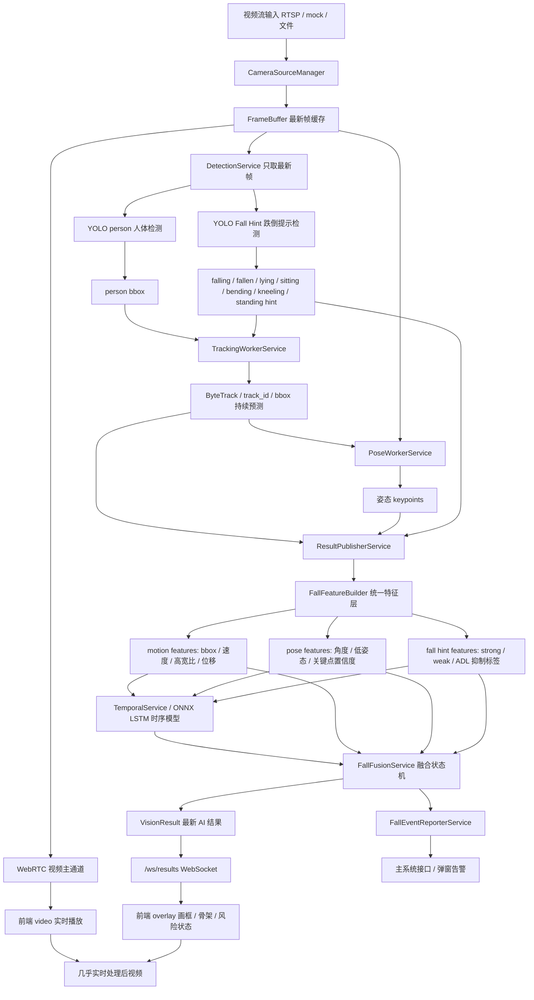
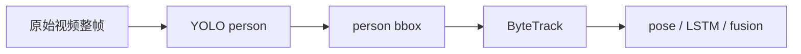

# Vision Service 交接文档

更新时间：2026-06-29  
项目路径：`D:\Program\vision_service`

## 1. 当前目标

当前系统目标是完成实时跌倒检测：

- 接收视频流。
- 前端稳定实时显示视频。
- AI 旁路异步分析最新帧，不阻塞视频播放。
- 检测人体、跟踪人体、估计姿态、识别跌倒提示、使用 LSTM 时序模型判断前后帧状态。
- 通过融合状态机输出最终跌倒状态。
- 对跌倒进行风险分级。
- confirmed fall 后向主系统接口上报告警，并支持主系统前端弹窗。

本阶段优先策略是：**误报优先**。  
也就是说，`fallen_confirmed` 必须严格，不能由单个模型直接触发；候选状态可以敏感，但最终告警必须经过多证据确认。

## 2. 当前真实系统链路

当前系统基本按照之前确定的“视频主通道 + AI 旁路异步分析”方案完成重构。  
真实链路与旧图的主要差异是：`YOLO Fall Hint` 当前直接读取原始整帧视频，不是在 tracking 之后只检测裁剪人体图；之后再通过 IoU 与 tracking bbox 进行匹配。



## 3. 当前运行配置

关键配置来自：`D:\Program\vision_service\.env`

当前重要开关：

- `DETECTION_ENABLED=true`
- `YOLO_MODEL_PATH=yolov8n.pt`
- `DETECTION_INTERVAL_MS=200`
- `FALL_DETECTOR_ENABLED=true`
- `YOLO_FALL_MODEL_PATH=models/yolo_fall_hint_v2_plus_b012_best.pt`
- `YOLO_FALL_CONFIDENCE=0.25`
- `ENABLE_TRACKING=true`
- `ENABLE_POSE=true`
- `POSE_PROVIDER=yolo11_legacy`
- `POSE_WORKER_FPS=2`
- `ENABLE_TEMPORAL=true`
- `TEMPORAL_MODEL_PROVIDER=onnx_lstm`
- `TEMPORAL_ONNX_MODEL_PATH=models/fall_lstm_v5.onnx`
- `FIELD_FALL_CANDIDATE_ENABLED=true`
- `MAIN_SYSTEM_ALERT_ENABLED=true`
- `MAIN_SYSTEM_BASE_URL=http://192.168.8.254:8000/api/v1`
- `WEBRTC_VIDEO_FPS=25`

注意：`app/core/config.py` 会主动读取 `.env`，所以只改默认值不够，`.env` 也必须同步。

## 4. 已完成的核心工作

### 4.1 链路重构

已完成：

- 视频进入 `FrameBuffer`，AI 只读取最新帧。
- WebRTC 视频主通道不等待 AI。
- AI 结果通过 `/ws/results` 推送给前端。
- 前端通过 canvas overlay 把检测框、姿态、风险状态叠加到实时视频上。
- `DetectionService` 同时运行：
  - `YOLO person`
  - `YOLO Fall Hint`
- `TrackingWorkerService` 接入 ByteTrack 跟踪和 bbox 保持/预测。
- `PoseWorkerService` 从 tracking 结果和对应帧中提取姿态。
- `ResultPublisherService` 汇总 tracking、pose、fall hint、temporal、fusion。
- `FallFeatureBuilder` 建立统一特征层。
- `FallFusionService` 作为误报优先的最终融合状态机。
- `FallEventReporterService` 负责 confirmed fall 后主系统上报。

### 4.2 YOLO Fall Hint 模型升级

已完成新模型训练和接入。

最新模型：

```text
D:\Program\vision_service\models\yolo_fall_hint_v2_plus_b012_best.pt
```

指标文件：

```text
D:\Program\vision_service\models\yolo_fall_hint_v2_plus_b012_metrics.json
```

模型 SHA256：

```text
4BAFC88B2EC068921776C8D4D0E4EFD020DFAB29AFD313044ECFB07098CA67A8
```

类别：

```text
0 falling
1 fallen
2 lying
3 sitting
4 bending
5 kneeling
6 standing
```

关键指标：

- `val mAP50`: `0.761`
- `val mAP50-95`: `0.579`
- `fallen recall`: `0.890`
- `falling recall`: `0.700`
- targeted `batch_012` kneeling recall：
  - 旧模型：`0 / 74`
  - 新模型：`74 / 74`

结论：

- 该模型作为 **YOLO Fall Hint / 候选证据模型** 是合格的。
- 该模型不能作为最终 confirmed fall 模型单独触发告警。
- `falling / fallen / fall` 作为 strong hint。
- `lying` 作为 weak hint。
- `sitting / bending / kneeling / standing` 作为 ADL 抑制证据。

### 4.3 YOLO Fall Hint 接入改动

已完成：

- `.env`
  - `YOLO_FALL_MODEL_PATH=models/yolo_fall_hint_v2_plus_b012_best.pt`
- `.env.example`
  - 同步新模型路径。
- `README.md`
  - 同步配置示例。
- `app/core/config.py`
  - 默认 fall hint 模型路径改为新模型。
- `scripts/start_current_camera.py`
  - 启动脚本同步新模型路径。
- `app/detection/yolo_fall_detector.py`
  - 允许输出新类别：
    - `fall`
    - `falling`
    - `fallen`
    - `lying`
    - `sitting`
    - `bending`
    - `kneeling`
    - `standing`
- `app/fall/feature_builder.py`
  - strong hint 增加 `falling`。
- `app/services/result_publisher_service.py`
  - strong hint 增加 `falling`。
- `app/services/tracking_worker_service.py`
  - 修复安全问题：只有 `fall / falling / fallen` 能被提升为补充 person candidate。
  - `sitting / bending / kneeling / standing` 不会被提升成跌倒候选框，只能作为抑制误报证据。

### 4.4 已通过测试

已运行：

```powershell
python -m pytest tests/test_tracking_worker_service.py tests/test_yolo_fall_detector.py tests/test_fall_feature_builder.py tests/test_fall_fusion.py tests/test_detection_service.py tests/test_result_publisher_service.py
```

结果：

```text
31 passed
```

另已验证新模型可以被实际加载：

```powershell
& 'C:\Users\YANG\.conda\envs\torchgpu\python.exe' -c "from app.core.config import Settings; from app.detection.yolo_fall_detector import YoloFallDetector; s=Settings(); print(s.yolo_fall_model_path); d=YoloFallDetector(s); print(d.status())"
```

结果状态：

```text
FallDetectorStatus(enabled=True, loaded=True, model_name='models/yolo_fall_hint_v2_plus_b012_best.pt', last_error=None)
```

## 5. 当前模型分工

### 5.1 YOLO person 人体检测模型

当前模型：

```text
yolov8n.pt
```

链路位置：



输入图像：

- 原始视频帧整图。
- 不是裁剪图。
- 不是已经画框的图。
- 不是 pose 或 fall hint 处理后的图。

训练数据应该是：

- 原始视频抽帧得到的完整画面。
- 只标注人体框。
- 类别建议只有一个：`person`。
- 站立、行走、坐下、弯腰、跪地、躺倒、跌倒中、跌倒后都统一标为 `person`。
- 多人场景每个人都标。
- 无人画面可以保留为空标签负样本。

下一步用户计划：采集和人工标注新的 YOLO person 数据集，然后训练更适合跌倒场景的人体检测模型。

### 5.2 YOLO Fall Hint 跌倒提示模型

当前最新模型：

```text
models/yolo_fall_hint_v2_plus_b012_best.pt
```

任务：

- 不是最终跌倒判断。
- 输出视觉提示标签：
  - `falling`
  - `fallen`
  - `lying`
  - `sitting`
  - `bending`
  - `kneeling`
  - `standing`

用途：

- `falling / fallen / fall`：强跌倒候选证据。
- `lying`：弱跌倒证据，需要结合快速下降、低姿态、时序等。
- `sitting / bending / kneeling / standing`：正常动作抑制证据，降低误报。

### 5.3 Pose 姿态模型

当前配置：

```text
ENABLE_POSE=true
POSE_PROVIDER=yolo11_legacy
YOLO11_POSE_MODEL_PATH=yolo11n-pose.pt
```

链路位置：

- 使用 tracking 后的 person bbox 和对应原始帧。
- 输出 keypoints。
- 结果绑定 `track_id`。
- pose 结果有 TTL，过期后前端不继续画旧骨架。

用途：

- 提供低姿态、躯干角度、关键点可信度等证据。
- 不是最终跌倒模型。

### 5.4 LSTM / Temporal 时序模型

当前配置：

```text
ENABLE_TEMPORAL=true
TEMPORAL_MODEL_PROVIDER=onnx_lstm
TEMPORAL_ONNX_MODEL_PATH=models/fall_lstm_v5.onnx
TEMPORAL_FEATURE_SCHEMA_PATH=models/fall_lstm_v5_features.json
```

用途：

- 根据连续帧特征判断跌倒概率。
- 输入特征来自 bbox motion、pose、窗口状态等。
- 当前由 `TemporalService` 维护 feature window 和 state machine。

注意：

- 当前 LSTM 仍是准确率短板之一，后续可以继续重训。
- 但本轮优先在 YOLO Fall Hint 上做了升级。

### 5.5 Fusion 融合状态机

文件：

```text
D:\Program\vision_service\app\fall\fusion.py
```

用途：

- 最终决定：
  - `normal`
  - `suppressed`
  - `fallen_candidate`
  - `fallen_confirmed`
- 误报优先。
- 单个 fall hint 不能直接 confirmed。
- tracking 不稳定时禁止 confirmed。
- ADL-like 姿态优先 suppressed。
- confirmed 需要多证据组合，例如：
  - LSTM 高概率 + 低姿态 + 静止。
  - 快速下降 + 低姿态 + strong fall hint。
  - pose/motion 多证据满足持续时间和连续帧要求。

## 6. 当前前端逻辑

前端路径：

```text
D:\Program\vision_service\frontend_demo
```

核心文件：

- `frontend_demo/app.js`
- `frontend_demo/overlay.js`

当前输出方式：

- WebRTC 播放实时视频。
- WebSocket `/ws/results` 接收 AI 结果。
- canvas overlay 绘制：
  - bbox
  - track id
  - pose skeleton
  - fall state
  - risk level
  - confirmed/candidate 状态

重要点：

- 后端没有重新编码“带框视频流”。
- “处理后视频”是在前端由实时视频 + overlay 合成。
- 这是为了保证视频流畅，避免 AI 推理阻塞视频。

## 7. 当前告警链路

文件：

```text
D:\Program\vision_service\app\services\fall_event_reporter_service.py
```

触发条件：

- `fall_decision.fall_state == fallen_confirmed`
- 或 `alarm_preview.confirmed == true` 且风险为 high/critical。
- 还要经过 person evidence 和 reporter guard 检查。

上报目标：

```text
MAIN_SYSTEM_BASE_URL=http://192.168.8.254:8000/api/v1
MAIN_SYSTEM_FALL_EVENT_PATH=/video-bridge/fall-events
```

当前现实限制：

- 之前确认过：真实 RTSP 和主系统网络可能不可达，因为摄像头/主系统与当前机器不在同一网络下。
- 用户明确说过：暂时先不解决 RTSP/主系统不可达问题，优先解决模型准确率问题。

## 8. 数据集与人工标注进展

### 8.1 YOLO Fall Hint 数据集

已经完成多批人工标注，并用于训练当前最新 fall hint 模型。

当前最新指标文件显示：

- 数据集路径：`datasets/fall_hint_v2`
- 数据集条目数量：`1334`
- 新增 targeted batch：`batch_012`
- `batch_012` 使用人工复核图像：`119`
- 有一张缺少 reviewed metadata，被 dataset builder 排除。

相关脚本：

- `scripts/prepare_fall_hint_v2_batch.py`
- `scripts/prelabel_fall_hint_v2_batch.py`
- `scripts/build_fall_hint_v2_dataset.py`
- `scripts/check_fall_hint_yolo_dataset.py`
- `tools/fall_hint_labeler/`

### 8.2 YOLO person 数据集

用户下一步要开始采集和人工标注。

核心标注原则：

- 输入图像：原始视频整帧。
- 类别：只标 `person`。
- 所有人体状态都标为 person：
  - standing
  - walking
  - sitting
  - bending
  - kneeling
  - lying
  - falling
  - fallen
- 不标 fall/fallen/sitting 这些类别。
- 无人画面保留为空标签负样本。
- 不要用已经画框/画骨架/带文字的视频帧。

为什么要这样：

- YOLO person 的任务是稳定找人，不判断跌倒。
- 如果跌倒后横躺、跪地、弯腰的人没有被标成 person，后续 tracking、pose、LSTM、fusion 都会失去基础目标。

## 9. 重要代码位置

服务装配：

```text
D:\Program\vision_service\app\main.py
D:\Program\vision_service\app\core\runtime.py
D:\Program\vision_service\app\core\config.py
```

视频源与缓存：

```text
D:\Program\vision_service\app\camera
```

人体检测：

```text
D:\Program\vision_service\app\detection\object_detector.py
```

Fall Hint 检测：

```text
D:\Program\vision_service\app\detection\yolo_fall_detector.py
```

Detection worker：

```text
D:\Program\vision_service\app\services\detection_service.py
```

Tracking：

```text
D:\Program\vision_service\app\services\tracking_worker_service.py
D:\Program\vision_service\app\services\tracking_service.py
```

Pose：

```text
D:\Program\vision_service\app\services\pose_worker_service.py
D:\Program\vision_service\app\services\pose_service.py
```

Temporal / LSTM：

```text
D:\Program\vision_service\app\services\temporal_service.py
D:\Program\vision_service\app\temporal
```

统一特征层与融合：

```text
D:\Program\vision_service\app\fall\feature_builder.py
D:\Program\vision_service\app\fall\fusion.py
```

结果发布：

```text
D:\Program\vision_service\app\services\result_publisher_service.py
```

主系统告警：

```text
D:\Program\vision_service\app\services\fall_event_reporter_service.py
```

前端：

```text
D:\Program\vision_service\frontend_demo\app.js
D:\Program\vision_service\frontend_demo\overlay.js
```

## 10. 当前 Git 状态提醒

当前仓库存在大量已修改和未跟踪文件。不要随意 revert。

已修改文件包括：

- `.env.example`
- `README.md`
- `app/core/config.py`
- `app/core/runtime.py`
- `app/detection/object_detector.py`
- `app/detection/yolo_fall_detector.py`
- `app/main.py`
- `app/schemas/status.py`
- `app/schemas/vision_result.py`
- `app/services/detection_service.py`
- `app/services/result_publisher_service.py`
- `app/services/status_service.py`
- `app/services/stream_service.py`
- `app/services/tracking_worker_service.py`
- `frontend_demo/app.js`
- `frontend_demo/overlay.js`
- `scripts/evaluate_fall_video_offline.py`
- `scripts/start_current_camera.py`
- `tests/test_tracking_worker_service.py`

未跟踪目录/文件包括：

- `app/fall/`
- `models/external/`
- `models/yolo_fall_hint_v2_plus_b012_metrics.json`
- `scripts/build_fall_hint_v2_dataset.py`
- `scripts/check_fall_hint_yolo_dataset.py`
- `scripts/prelabel_fall_hint_v2_batch.py`
- `scripts/prepare_cvat_import_batch001.py`
- `scripts/prepare_fall_hint_v2_batch.py`
- `tests/test_detection_service.py`
- `tests/test_fall_feature_builder.py`
- `tests/test_fall_fusion.py`
- `tests/test_yolo_fall_detector.py`
- `tools/fall_hint_labeler/`

下一轮对话如果要继续开发，应先重新执行：

```powershell
git status --short
```

并避免覆盖用户或前一轮已完成但未提交的工作。

## 11. 当前已知问题与风险

### P0：真实 RTSP / 主系统网络不可达

状态：暂缓。  
原因：当前机器与摄像头或主系统可能不在同一网络。  
用户已明确：暂时先不解决这个问题。

### P1：模型准确率仍需要继续提升

状态：正在处理。

已完成：

- YOLO Fall Hint 已升级到 `yolo_fall_hint_v2_plus_b012_best.pt`。
- kneeling 数据补强后误报风险明显下降。

下一步：

- 训练更适合系统场景的 YOLO person 人体检测模型。
- 后续再考虑 LSTM 数据集和时序模型重训。

### P2：YOLO person 当前还是通用模型

当前使用：

```text
yolov8n.pt
```

风险：

- 对跌倒后横躺人体、遮挡人体、弯腰/跪地人体、小目标人体可能不够稳定。
- 如果 person 检测漏掉，后续 tracking、pose、temporal、fusion 都会受影响。

下一步重点就是采集和标注 YOLO person 数据集。

### P3：LSTM confirmed recall 仍可能不足

当前使用：

```text
models/fall_lstm_v5.onnx
```

风险：

- 如果 LSTM 对真实跌倒前后帧召回不足，会导致 confirmed 慢或漏检。
- 但由于当前是误报优先策略，短期可以通过 fall hint + field rule + fusion 先补足一部分。

## 12. 下一轮建议任务顺序

建议新对话按这个顺序继续：

1. 先确认当前系统能正常启动，保留新 YOLO Fall Hint 模型。
2. 开始 YOLO person 数据集准备。
3. 从用户已有视频和下载数据中抽帧，生成一批 120 张人工标注任务。
4. 标注规则只使用 `person` 一个类别。
5. 人工标注完成后，导出 YOLO 格式。
6. 训练 YOLO person 模型。
7. 用当前系统视频回放验证：
   - person bbox 是否稳定。
   - 横躺人体是否能检测到。
   - 跪地/弯腰/坐地是否仍然被识别为 person。
   - 检测框是否闪烁。
   - tracking 是否连续。
8. 再接入新的 YOLO person 模型替换 `yolov8n.pt`。
9. 跑链路测试和离线评估。
10. 再决定是否继续重训 LSTM。

## 13. 新对话可直接使用的启动提示词

可以在新对话中这样开头：

```text
请先阅读 D:\Program\vision_service\docs\HANDOFF_2026-06-29.md，然后继续当前项目。现在我要开始 YOLO person 人体检测模型的数据集采集和人工标注准备。请先检查当前项目状态，确认不要覆盖已有修改，然后根据交接文档继续。
```

## 14. 关键判断结论

当前系统不是旧式“后端输出带框视频流”的结构，而是：

```text
实时视频 WebRTC 主通道 + AI 结果 WebSocket + 前端 overlay 合成处理后视频
```

这是为了保证视频流畅性。

当前系统真实链路已经基本符合之前确定的目标架构：

- 视频不等待 AI。
- AI 只处理最新帧。
- 检测、跟踪、姿态、fall hint、LSTM、fusion 都已接入。
- 新 YOLO Fall Hint 模型已经替换旧模型。
- ADL 标签不会被误提升为跌倒候选。
- confirmed fall 后有主系统告警上报链路。

下一步的主要任务不是继续改链路，而是提升基础模型质量，优先从 `YOLO person` 开始。
