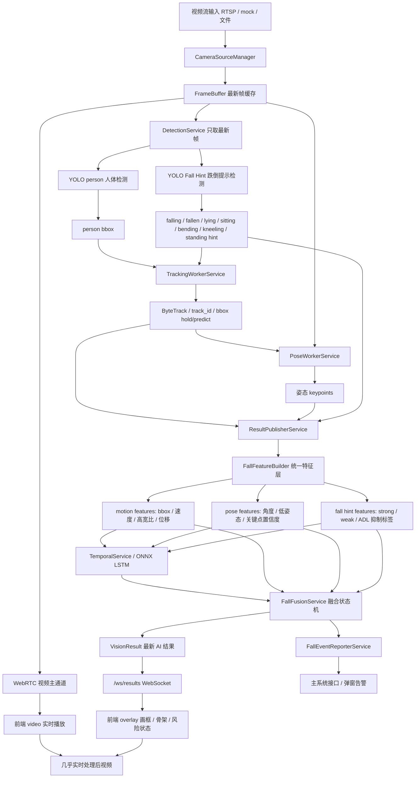

# Vision Service 项目完整交接文档

更新时间：2026-07-01  
项目路径：`D:\Program\vision_service`  
当前分支：`feature/pose-model-qualification`  
当前本地回档提交：`6c6a37a`  
当前本地回档标签：`checkpoint-realtime-fall-pipeline-20260630`

> 注意：本文档用于工作人员交接。不要把本地 `.env`、摄像头账号密码、真实 token、模型权重、数据集、运行日志直接公开上传。

## 1. 项目目标

本项目是一个实时跌倒检测视觉服务，目标是：

- 接收摄像头 RTSP 或其他视频源。
- 前端稳定实时显示视频。
- AI 旁路异步分析最新帧，不阻塞视频播放。
- 检测人体、跟踪人体、估计姿态、识别跌倒提示、使用 LSTM 时序模型判断前后帧状态。
- 通过融合状态机输出最终跌倒状态。
- 对跌倒事件进行风险分级。
- 在确认跌倒后向主系统接口上报告警，使主系统前端可以弹出告警。

当前产品策略是：**误报优先**。

含义：

- `fallen_confirmed` 必须严格。
- 单个模型不能直接触发最终 confirmed 告警。
- 候选状态可以敏感，但主系统告警必须经过多证据确认。
- 对 ADL 正常动作，例如 sitting、bending、kneeling、lying_non_fall，优先抑制误报。

## 2. 当前真实系统链路

当前系统基本完成了目标链路重构：**视频主通道实时输出，AI 旁路只处理最新帧，前端 overlay 合成处理后视频**。



关键说明：

- 后端不重新编码“带框视频流”。
- 前端通过 WebRTC 视频 + WebSocket AI 结果 + canvas overlay 合成处理后视频。
- 这套方式是为了保证视频流畅，避免 AI 推理拖慢视频播放。
- 当前 `YOLO Fall Hint` 是读取原始整帧，不是 tracking 后裁剪图；后续通过 IoU 与 tracking bbox 匹配。

## 3. 当前运行配置状态

当前 `.env` 是本地真实运行配置，包含摄像头密码，不能上传。

当前关键配置概览：

```text
DEFAULT_RTSP_URL=<本地真实 RTSP，含账号密码，已省略>
MOCK_CAMERA_ENABLED=false
YOLO_MODEL_PATH=yolov8n.pt
YOLO_DEVICE=cuda:0
YOLO_FALL_MODEL_PATH=models/yolo_fall_hint_v2_plus_b012_best.pt
YOLO_FALL_DEVICE=cuda:0
ENABLE_POSE=true
POSE_PROVIDER=yolo11_legacy
YOLO11_POSE_MODEL_PATH=models/pose_yolo_batch001_003_yolo11s_best.pt
ENABLE_TEMPORAL=true
TEMPORAL_ONNX_MODEL_PATH=models/fall_lstm_v5.onnx
MAIN_SYSTEM_BASE_URL=http://192.168.8.253:8000/api/v1
VISION_SERVICE_PUBLIC_BASE_URL=http://192.168.8.252:8000
CAPTURE_BACKEND=subprocess_opencv
```

注意：

- `app/core/config.py` 会主动读取 `.env`。
- 只修改 `config.py` 默认值不够；真实运行以 `.env` 为准。
- `.env.example` 是公开模板，不应该包含真实密码或 token。

## 4. 已完成的链路重构工作

已完成：

- 视频进入 `FrameBuffer`。
- AI 使用 `FrameBuffer.latest()` 取最新帧。
- WebRTC 视频主通道不等待 AI。
- `/ws/results` 推送 AI 结果给前端。
- 前端 overlay 支持 bbox 平滑、TTL、淡出，减少闪框。
- `DetectionService` 同时运行：
  - `YOLO person`
  - `YOLO Fall Hint`
- `YOLO Fall Hint` 有独立限频：
  - `FALL_DETECTOR_INTERVAL_MS`
- `TrackingWorkerService` 接入：
  - ByteTrack
  - bbox hold/predict
  - fall-only strong hint 受控提升
- `PoseWorkerService` 从 tracking 对象和对应原始帧生成姿态。
- `TemporalService` 接入 ONNX LSTM。
- `FallFeatureBuilder` 统一构建 motion / pose / fall_hint 特征。
- `FallFusionService` 接入误报优先融合状态机。
- `FallEventReporterService` 接入主系统告警上报。
- 前端 WebRTC/WebSocket 自动重连逻辑和 overlay 调试状态增强。

## 5. 当前模型分工

### 5.1 YOLO person 人体检测模型

当前实际运行：

```text
YOLO_MODEL_PATH=yolov8n.pt
```

说明：

- 这是通用 YOLO person 模型。
- 虽然已经训练出新的 person 模型，但还没有接入 `.env` 替换运行。

已训练出的 person 候选模型包括：

```text
models/person_yolo_batch001_yolov8n_best.pt
models/person_yolo_batch001_003_yolov8n_best.pt
models/person_yolo_batch001_004_yolov8n_best.pt
models/person_yolo_batch001_005_yolov8n_best.pt
models/person_yolo_batch001_008_yolov8n_best.pt
```

已提交到 Git 的是指标 JSON，不包含 `.pt` 权重：

```text
models/person_yolo_batch001_yolov8n_metrics.json
```

第一版 person 模型指标概要：

- 数据集：`datasets/person_yolo`
- 原始标注批次：`datasets/person_yolo_raw/batch_001`
- 数据量：120 张图
- 类别：`person`
- test mAP50：约 `0.995`
- test mAP50-95：约 `0.732`
- 与 baseline `yolov8n.pt` 相比有提升

注意：

- 该指标来自小样本测试集，不能直接等价于生产效果。
- 指标文件里也写明建议：不要直接替换，先准备更多 hard negatives 和视频回放验证。

YOLO person 数据集原则：

- 输入图像是原始视频整帧。
- 不是裁剪图。
- 不是已经画框、画骨架、带文字、带 overlay 的处理后图。
- 类别只标 `person`。
- standing、walking、sitting、bending、kneeling、lying、falling、fallen 都统一标为 `person`。
- 没有人的图可以保留为空标签负样本。

### 5.2 YOLO Fall Hint 跌倒提示模型

当前实际运行：

```text
YOLO_FALL_MODEL_PATH=models/yolo_fall_hint_v2_plus_b012_best.pt
```

权重路径：

```text
D:\Program\vision_service\models\yolo_fall_hint_v2_plus_b012_best.pt
```

指标文件：

```text
D:\Program\vision_service\models\yolo_fall_hint_v2_plus_b012_metrics.json
```

类别：

```text
0 falling
1 fallen
2 lying
3 sitting
4 bending
5 kneeling
6 standing
```

关键指标：

- `val mAP50`: `0.761`
- `val mAP50-95`: `0.579`
- `fallen recall`: `0.890`
- `falling recall`: `0.700`
- targeted batch_012 kneeling recall：
  - 旧模型：`0 / 74`
  - 新模型：`74 / 74`

结论：

- 作为 fall hint / 候选证据模型合格。
- 不能单独作为最终 confirmed fall 检测器。

当前逻辑：

- `fall / falling / fallen` 是 strong hint。
- `lying` 是 weak hint。
- `sitting / bending / kneeling / standing` 是 ADL 抑制证据。
- tracking 层只允许 `fall / falling / fallen` 这类强标签提升为补充 candidate person。
- ADL 标签不会被误提升成跌倒候选。

### 5.3 Pose 姿态模型

当前实际配置：

```text
ENABLE_POSE=true
POSE_PROVIDER=yolo11_legacy
YOLO11_POSE_MODEL_PATH=models/pose_yolo_batch001_003_yolo11s_best.pt
```

已训练/评估的 pose 模型指标文件：

```text
models/pose_yolo_batch001_003_yolo11s_metrics.json
models/pose_yolo_batch001_003_yolo11s_link_match_metrics.json
models/pose_yolo_batch001_003_yolo11n_metrics.json
models/pose_yolo_batch001_003_yolo11n_flip_metrics.json
```

当前 yolo11s pose 候选与 baseline 对比概要：

- baseline：`yolo11n-pose.pt`
- candidate：`models/pose_yolo_batch001_003_yolo11s_best.pt`
- candidate box mAP50：`0.995`
- candidate pose mAP50：`0.995`
- candidate pose mAP50-95：约 `0.849`
- candidate 推理速度优于 baseline 指标文件中的记录

注意：

- pose 主要作为证据来源，不是最终 confirmed 模型。
- 当前系统需要先有稳定 person/tracking，pose 才能实际工作。

### 5.4 LSTM / Temporal 时序模型

当前实际运行：

```text
TEMPORAL_MODEL_PROVIDER=onnx_lstm
TEMPORAL_ONNX_MODEL_PATH=models/fall_lstm_v5.onnx
```

用途：

- 基于连续帧特征输出跌倒概率。
- 结合 motion、pose、bbox 运动等特征。
- 当前仍是准确率风险点之一，后续可继续重训。

### 5.5 Fusion 融合状态机

文件：

```text
app/fall/fusion.py
```

功能：

- 最终输出 `normal / suppressed / fallen_candidate / fallen_confirmed`。
- 单模型不能直接 confirmed。
- tracking 不稳定时禁止 confirmed。
- ADL-like 姿态优先 suppressed。
- confirmed 需要多证据和持续帧/持续时间条件。

核心 evidence：

- motion
- pose
- fall_hint
- temporal

## 6. 数据集与标注工具

已经建立三套本地标注/准备工具：

```text
tools/fall_hint_labeler/
tools/person_labeler/
tools/pose_labeler/
```

相关脚本：

```text
scripts/prepare_fall_hint_v2_batch.py
scripts/prelabel_fall_hint_v2_batch.py
scripts/build_fall_hint_v2_dataset.py
scripts/check_fall_hint_yolo_dataset.py

scripts/prepare_person_yolo_batch.py
scripts/prepare_person_yolo_unique_batches.py
scripts/prepare_person_yolo_remaining_batches.py
scripts/build_person_yolo_dataset.py
scripts/train_person_yolo.py
scripts/evaluate_person_yolo.py
scripts/audit_person_yolo_predictions.py

scripts/prepare_pose_yolo_batch.py
scripts/prelabel_pose_yolo_batch.py
scripts/build_pose_yolo_dataset.py
scripts/train_pose_yolo.py
scripts/evaluate_pose_yolo.py
scripts/evaluate_pose_link_match.py
```

数据集、原始视频、训练 runs 不应上传 GitHub：

```text
datasets/
runs/
logs/
data/
```

模型权重也不应上传：

```text
*.pt
*.pth
*.onnx
*.engine
*.zip
```

这些已在 `.gitignore` 中排除。

## 7. 当前前端状态

前端目录：

```text
frontend_demo/
```

核心文件：

```text
frontend_demo/app.js
frontend_demo/overlay.js
frontend_demo/index.html
```

当前能力：

- 通过 WebRTC 接收视频。
- 通过 `/ws/results` 接收 AI 结果。
- 使用 canvas overlay 绘制：
  - bbox
  - track id
  - pose skeleton
  - fall state
  - risk level
  - confirmed/candidate 状态
- 支持 bbox 缓存、平滑、TTL、淡出。
- 支持 WebRTC / WebSocket 重连。
- 支持显示调试状态。

注意：

- “处理后视频”不是后端编码输出，而是前端合成。
- 这是当前保证流畅性的重要设计。

## 8. 主系统告警链路

文件：

```text
app/services/fall_event_reporter_service.py
```

告警触发：

- `fall_decision.fall_state == fallen_confirmed`
- 或 `alarm_preview.confirmed == true` 且 risk 为 high/critical
- 还会经过 person evidence 和 reporter guard 检查

当前本地 `.env` 指向：

```text
MAIN_SYSTEM_BASE_URL=http://192.168.8.253:8000/api/v1
MAIN_SYSTEM_FALL_EVENT_PATH=/video-bridge/fall-events
```

相关对接文档：

```text
docs/main_system_bridge_api_2026-06-30.md
```

注意：

- IP 地址可能随 WiFi/热点变化，不要把 `192.168.8.253 / 192.168.8.254` 当成永久配置。
- `.env` 中真实 token 不应提交。

## 9. 最近运行状态与问题

最近一次检查中，系统服务运行在：

```text
uvicorn app.main:app --host 0.0.0.0 --port 8000
```

曾确认：

- 主服务在 8000 端口运行。
- 摄像头采集子进程运行过。
- 主系统告警曾返回 `http_200`。

但后续状态中出现过：

```text
stream_state = reconnecting
connected = false
capture_process_alive = false
reconnect_reason = capture_process_frame_timeout
capture_process_last_error = first frame timeout
latest_detection_age_ms > 200000ms
detection_to_publish_lag_ms > 200000ms
```

结论：

- 架构逻辑基本正确。
- 当前真实运行稳定性受 RTSP 采集影响。
- 当 RTSP stale 时，AI 结果会滞后，前端不满足实时要求。

下一步运行验证应先确认：

- `frame_age_ms` 回到几十毫秒或几百毫秒内。
- `stream_state=connected`
- `capture_process_alive=true`
- `latest_detection_age_ms` 不持续增长。

## 10. Git / GitHub 状态

当前本地分支：

```text
feature/pose-model-qualification
```

当前本地最新提交：

```text
6c6a37a checkpoint: realtime fall pipeline and model tooling
```

当前本地回档 tag：

```text
checkpoint-realtime-fall-pipeline-20260630
```

当前远程 GitHub 分支仍停留在：

```text
f468943 Checkpoint A5 label policy handoff
```

当前状态：

```text
feature/pose-model-qualification...origin/feature/pose-model-qualification [ahead 1]
```

说明：

- 本地当前版本已经提交。
- 本地 tag 已创建。
- 当前版本尚未成功上传 GitHub。
- 原因是当前机器访问 GitHub HTTPS 失败：
  - `Recv failure: Connection was reset`
  - `github.com:443` TCP 连接失败或超时
- SSH 网络端口可达，但本机没有 GitHub SSH 私钥，认证失败：
  - `Permission denied (publickey)`

本地已经创建可恢复 Git bundle：

```text
D:\Program\vision_service\backups\vision_service_checkpoint_realtime_fall_pipeline_20260630.bundle
```

bundle 验证结果：

```text
The bundle records a complete history.
bundle is okay
```

注意：

- `backups/` 当前是未跟踪目录。
- 这个 bundle 是本地备份包，不一定需要提交进 Git。
- 如需长期保存，可以手动复制到外部磁盘或网盘。

网络恢复后上传命令：

```powershell
git push origin feature/pose-model-qualification
git push origin checkpoint-realtime-fall-pipeline-20260630
```

如果要确认上传成功：

```powershell
git ls-remote --heads origin feature/pose-model-qualification
git ls-remote --tags origin checkpoint-realtime-fall-pipeline-20260630
```

成功后应该能看到 commit `6c6a37a...` 对应分支。

## 11. 回档方式

查看本地回档点：

```powershell
git show checkpoint-realtime-fall-pipeline-20260630
```

基于回档点新建恢复分支：

```powershell
git switch -c restore-realtime-fall-pipeline checkpoint-realtime-fall-pipeline-20260630
```

从 bundle 恢复：

```powershell
git clone D:\Program\vision_service\backups\vision_service_checkpoint_realtime_fall_pipeline_20260630.bundle restored_vision_service
cd restored_vision_service
git switch feature/pose-model-qualification
```

不要在当前工作区随意执行：

```powershell
git reset --hard
git checkout -- .
```

除非明确知道会丢弃哪些本地工作。

## 12. 当前未完成事项

### 12.1 GitHub 上传未完成

本地提交和 tag 已完成，但远程未上传。

优先级：高。

处理方式：

- 等网络恢复。
- 或配置 GitHub SSH key。
- 或把 bundle 交给可访问 GitHub 的机器再 push。

### 12.2 新 YOLO person 模型尚未接入运行

虽然已经训练出多个候选 person 模型，但 `.env` 仍使用：

```text
YOLO_MODEL_PATH=yolov8n.pt
```

下一步如果要验证 person 检测优化，应选择一个候选权重并修改 `.env`：

```text
YOLO_MODEL_PATH=models/person_yolo_batch001_008_yolov8n_best.pt
```

但建议接入前先做：

- 回放测试。
- hard negative 测试。
- 真机画面观察。
- bbox 稳定性观察。

### 12.3 RTSP 稳定性仍需验证

当前 `subprocess_opencv` 后端增强了超时处理，但真实 RTSP 仍可能：

- first frame timeout
- reconnecting
- stale frame
- capture process restart

需要长稳测试：

- 30 分钟。
- 2 小时。
- 观察内存、frame_age、restart_count、result lag。

### 12.4 LSTM 仍有准确率风险

当前 LSTM 使用：

```text
models/fall_lstm_v5.onnx
```

短期可先通过 fusion、fall hint、field rule 保守确认。

长期建议：

- 建立冻结评估集。
- 重新采集时序数据。
- 训练更可靠的 temporal 模型。

### 12.5 评估闭环仍需持续完善

已规划指标：

- `fall_event_recall`
- `confirmed_false_positive_count`
- `confirmed_false_positive_rate`
- `candidate_false_positive_count`
- `first_confirm_delay_ms`
- `missed_fall_count`
- `block_point`
- `suppressed_reason_distribution`

验收原则：

- ADL confirmed FP 必须优先压到 0。
- 再提升 fall recall。
- 最后优化 confirm delay。

## 13. 推荐下一步工作顺序

建议后续工作人员按此顺序继续：

1. 先确认 GitHub 是否已经能访问。
2. 推送本地提交和 tag：
   ```powershell
   git push origin feature/pose-model-qualification
   git push origin checkpoint-realtime-fall-pipeline-20260630
   ```
3. 确认远程分支包含 `6c6a37a`。
4. 恢复 RTSP 稳定连接，确保 `/status` 中：
   - `stream_state=connected`
   - `frame_age_ms` 正常
   - `capture_process_alive=true`
5. 验证当前链路在真实视频中是否持续输出。
6. 选择并接入新的 YOLO person 候选模型。
7. 做视频回放和真实画面验证：
   - person bbox 是否稳定。
   - 横躺人体是否能检测。
   - 跪地/弯腰/坐地是否识别为 person。
   - 检测框是否闪烁。
   - tracking 是否连续。
   - pose 是否绑定正确 track_id。
8. 再决定是否调整 LSTM 或 fusion 阈值。

## 14. 关键文件索引

服务装配：

```text
app/main.py
app/core/runtime.py
app/core/config.py
```

视频源：

```text
app/camera/source_manager.py
app/camera/capture_process.py
```

检测：

```text
app/detection/object_detector.py
app/detection/yolo_fall_detector.py
app/services/detection_service.py
```

跟踪：

```text
app/services/tracking_service.py
app/services/tracking_worker_service.py
```

姿态：

```text
app/services/pose_service.py
app/services/pose_worker_service.py
```

时序：

```text
app/services/temporal_service.py
app/temporal/
```

特征和融合：

```text
app/fall/feature_builder.py
app/fall/fusion.py
```

结果发布：

```text
app/services/result_publisher_service.py
```

告警：

```text
app/services/fall_event_reporter_service.py
```

前端：

```text
frontend_demo/app.js
frontend_demo/overlay.js
frontend_demo/index.html
```

训练/评估：

```text
scripts/train_person_yolo.py
scripts/evaluate_person_yolo.py
scripts/train_pose_yolo.py
scripts/evaluate_pose_yolo.py
scripts/evaluate_pose_link_match.py
scripts/evaluate_fall_video_offline.py
```

交接文档：

```text
docs/HANDOFF_2026-06-29.md
docs/PROJECT_HANDOFF_FULL_CONTEXT_2026-07-01.md
docs/main_system_bridge_api_2026-06-30.md
```

## 15. 新工作人员接手提示词

可以把下面这段给新工作人员或新的 Codex 对话：

```text
请先阅读 D:\Program\vision_service\docs\PROJECT_HANDOFF_FULL_CONTEXT_2026-07-01.md。
当前项目路径是 D:\Program\vision_service。
请先执行 git status --short --branch 和 git log --oneline --decorate -5，确认当前本地提交 6c6a37a 和 tag checkpoint-realtime-fall-pipeline-20260630 是否存在。
注意：本地当前版本可能还没有上传 GitHub，因为之前访问 github.com:443 失败。
请不要上传 .env、模型权重、数据集、runs、logs。
接手后优先处理：
1. 网络恢复后推送当前分支和 tag 到 GitHub；
2. 检查 RTSP 是否稳定；
3. 在确认链路稳定后，再选择并接入新的 YOLO person 模型；
4. 使用真实视频和回放验证 person/tracking/pose/fusion/告警全链路。
```

## 16. 一句话结论

当前系统的核心链路已经基本完成，并且本地已经创建可回档的 Git 提交和 tag；但 GitHub 上传尚未成功，真实运行稳定性仍受 RTSP 连接影响，新训练的 YOLO person 模型也尚未正式接入运行配置。
