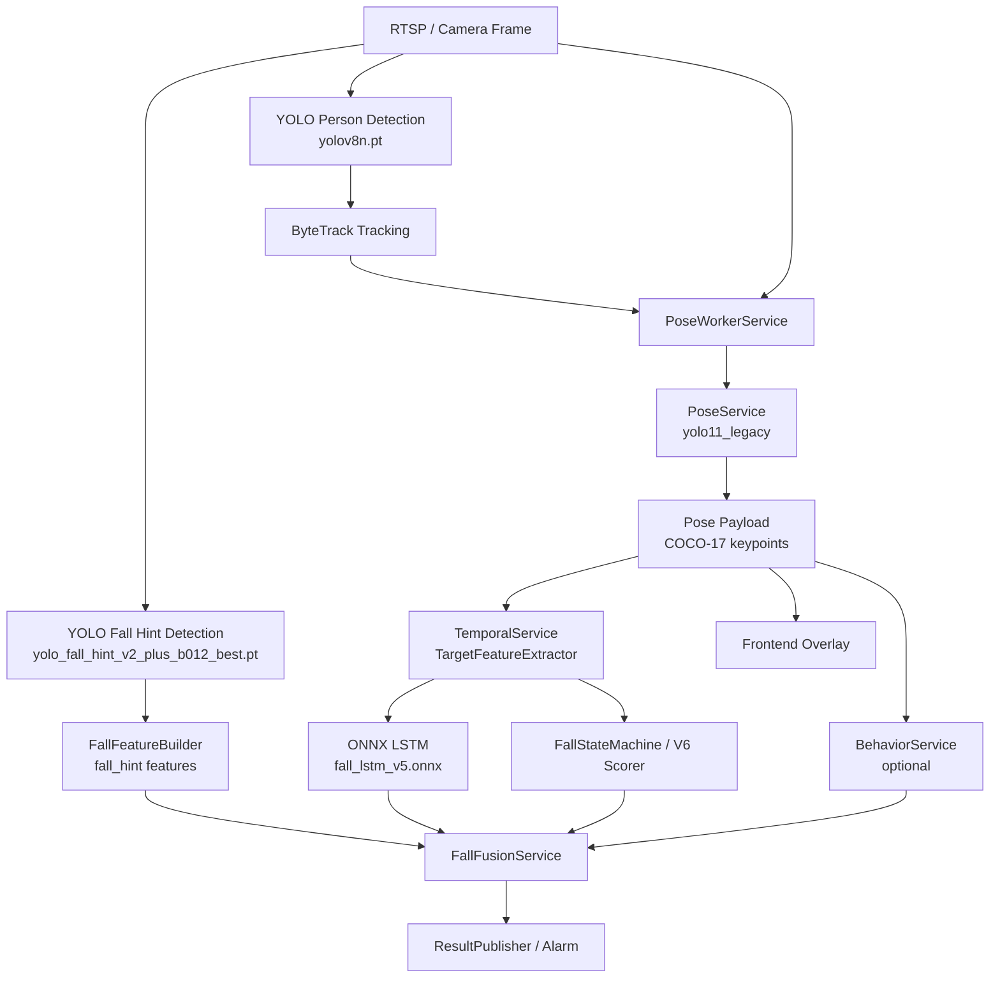

# 姿态检测与系统、其他模型关系说明

生成日期：2026-07-05  
工作区：`D:\Program\vision_service`

本文解释姿态检测在当前视觉服务中的位置，以及它和人体检测、跌倒提示检测、跟踪、行为识别、时序 LSTM、状态机、fusion guard、前端展示之间的关系。重点不是“姿态模型单独准不准”，而是姿态证据如何进入整条跌倒告警链路。

## 总体关系

当前系统的跌倒判断不是某一个模型说了算。姿态检测位于检测和跟踪之后，时序模型和融合规则之前。它更像一个证据加工站：把人体框里的几何信息转成关键点、躯干角、头髋高度、低姿态证据，再交给后续模块。



## 姿态检测在系统中的位置

姿态检测输入：

- 最新 detection frame。
- tracking snapshot 中的人体目标。
- 每个目标的 `track_id`、`bbox`、`is_target`。
- 当前配置中的 provider、模型路径、阈值、帧同步限制。

姿态检测输出：

- `pose.keypoints`：COCO-17 关键点。
- `pose.skeleton_confidence`：骨架平均置信度。
- `pose.source_bbox`：来自检测/跟踪的人体框。
- `pose.pose_bbox`：由关键点或模型框推导的姿态框。
- `pose.track_id` / `pose.source_track_id`：姿态和跟踪目标的绑定关系。
- `pose.debug`：匹配、拒绝、帧同步、质量门槛相关信息。

姿态检测不直接输出：

- 跌倒结论。
- 告警等级。
- 是否通知主系统。
- 是否老人本人。

这些由后续 temporal、fusion、reporter 等模块决定。

## 与人体检测模型的关系

人体检测当前模型：

```env
YOLO_MODEL_PATH=yolov8n.pt
YOLO_CONFIDENCE=0.35
```

关系：

- 人体检测先产生 person bbox。
- ByteTrack 基于 person bbox 生成稳定 track。
- 姿态检测必须依赖这些 bbox 和 track 才能把骨架绑定到具体对象。
- 如果人体检测漏人，姿态检测通常没有目标可跑。
- 如果人体框偏移或框住了错误对象，姿态匹配分数会下降，或者把骨架错误地绑定到 track。

影响链路：

| 人体检测问题 | 对姿态的影响 | 对告警的影响 |
|---|---|---|
| 漏检趴卧/低姿态人 | 没有 pose target | LSTM 和 fusion 缺少姿态证据 |
| bbox 太小 | 关键点容易落框外 | `keypoints_outside_bbox`、低姿态判断不稳 |
| bbox 包含多人 | pose candidate 匹配困难 | track/pose 错绑，误导后续 |
| 低置信度目标 | fallback 可能拒绝 | temporal 输入断续 |

结论：姿态检测不是人体检测的替代品。人检是地基，姿态是地基上的测量仪。地基歪了，测量仪读数再精细也没用。

## 与跟踪模型/ByteTrack 的关系

跟踪是姿态能否进入系统的关键门槛。

`PoseWorkerService` 优先使用 `realtime_store.latest_tracking(camera_id)`。如果没有 tracking，默认不跑姿态，除非开启：

```env
POSE_FALLBACK_TO_DETECTION=true
```

当前 `.env` 没有显式开启 fallback，因此姿态主要依赖 tracking。

姿态和跟踪之间有两个同步限制：

```env
POSE_MAX_TRACKING_FRAME_DELTA=2
POSE_MAX_FRAME_AGE_MS=500
```

含义：

- detection frame 和 tracking frame 差值超过 2，认为不同步，拒绝姿态。
- detection frame 超过 500ms，认为太旧，拒绝姿态。

典型拒绝：

| 拒绝原因 | 说明 |
|---|---|
| `no_tracking` | 没有可用 tracking snapshot |
| `frame_tracking_desync` | detection 和 tracking 帧序号错开太多 |
| `pose_frame_stale` | 姿态使用的原始帧太旧 |
| `pose_track_match_low_score` | 骨架候选无法可信匹配 track |
| `pose_track_mismatch` | 输出姿态 track 与对象 track 不一致 |

跟踪稳定性对时序模型尤其重要。LSTM 的窗口是按 track/person/spatial key 维护的。如果 track ID 频繁变化，姿态证据会碎成多个短窗口，时序判断就会变钝。

## 与跌倒提示检测模型的关系

跌倒提示检测当前模型：

```env
YOLO_FALL_MODEL_PATH=models/yolo_fall_hint_v2_plus_b012_best.pt
YOLO_FALL_CONFIDENCE=0.25
```

跌倒提示检测输出 `falling`、`fallen`、`lying`、`sitting`、`bending`、`kneeling`、`standing` 等标签。它和姿态检测不是上下游依赖关系，而是并行证据源。

关系：

- 跌倒提示检测提供类别线索：例如 `falling`、`fallen` 是强线索，`lying` 是弱线索，`sitting/bending/kneeling` 更像 ADL 反证据。
- 姿态检测提供几何线索：头髋位置、躯干角、骨架是否低姿态。
- `FallFeatureBuilder` 会把 fall hint 和 pose 同时整理进目标特征。
- `FallFusionService` 会要求多证据组合，例如 `rapid_descent + low_posture + strong_hint`，或者 `pose + motion`。

典型组合：

| 组合 | 意义 |
|---|---|
| `strong_hint + rapid_descent + low_posture` | 强跌倒候选 |
| `weak_hint(lying) + no descent` | 容易被抑制，防止正常躺卧误报 |
| `pose low_posture + stillness + temporal_probability` | 可支撑 fallen candidate |
| `kneeling/sitting/bending + ADL-like behavior` | 抑制误报 |

结论：跌倒提示模型负责“像不像跌倒姿势”，姿态模型负责“人体几何是否支持这个说法”。两者互相校验，不应该彼此替代。

## 与行为识别模块的关系

行为模块当前配置：

```env
ENABLE_BEHAVIOR=false
```

虽然当前关闭，但代码里已经存在 `BehaviorFeatureExtractor`。它从姿态关键点抽取：

- `head_y`
- `shoulder_y`
- `hip_y`
- `ankle_y`
- `torso_angle`
- bbox 宽高比
- 速度、垂直速度、静止时长

行为规则可识别：

- bending
- sitting
- kneeling
- stillness 等状态

这些行为在 fusion 中作为 ADL-like 反证据：

```text
behavior_state in {sitting, bending, kneeling}
```

影响：

- 如果行为模块启用，姿态质量会直接影响 ADL 抑制。
- 姿态错误可能把蹲跪误判成跌倒，也可能把真实跌倒压成 ADL。
- 当前行为模块关闭，因此这条链路暂时不是主决策路径，但它是后续降低误报的重要方向。

## 与时序 LSTM 模型的关系

当前时序模型：

```env
TEMPORAL_MODEL_PROVIDER=onnx_lstm
TEMPORAL_ONNX_MODEL_PATH=models/fall_lstm_v5.onnx
TEMPORAL_MODEL_WINDOW_SIZE=32
TEMPORAL_MODEL_INPUT_DIM=15
```

LSTM 的 15 维输入中，5 维直接来自姿态：

| 特征名 | 来源 | 含义 |
|---|---|---|
| `pose_available` | 姿态是否有可见关键点 | 该帧是否有姿态证据 |
| `pose_confidence` | skeleton/keypoint 平均置信度 | 骨架可信度 |
| `torso_angle_norm` | 肩髋连线角度 / 90 | 躯干倾斜程度 |
| `head_height_ratio_filled` | 头部 y 在 bbox 内比例 | 头部是否低 |
| `hip_height_ratio_filled` | 髋部 y 在 bbox 内比例 | 髋部是否低 |

如果没有姿态，填充值为：

| 特征 | 缺失填充值 |
|---|---:|
| `pose_available` | 0.0 |
| `pose_confidence` | 0.0 |
| `torso_angle_norm` | 0.0 |
| `head_height_ratio_filled` | -1.0 |
| `hip_height_ratio_filled` | -1.0 |

这说明姿态缺失不是“无影响”，而是以缺失值进入模型。LSTM 会看到“这一帧没有姿态”，并可能改变概率输出。

`TargetFeatureExtractor` 从姿态中计算：

```text
pose_available
pose_confidence
torso_angle
hip_height_ratio
head_height_ratio
```

其中 `hip_height_ratio` 和 `head_height_ratio` 是关键点相对 bbox 顶部的高度比例：

```text
ratio = (keypoint_y - bbox_y1) / bbox_height
```

比例越大，说明关键点越靠近人体框下方。当前低姿态判断常用：

```text
head_height_ratio > 0.45
hip_height_ratio > 0.65
```

这意味着，如果头和髋都落到 bbox 相对较低位置，系统会把它看作低姿态证据。

## 与状态机的关系

`FallStateMachine` 不直接读取原始 keypoints，而是读取 `TargetFeature` 中的姿态派生特征。

姿态参与以下判断：

1. 强 falling evidence  
   如果 `fall_probability >= FALLING_PROB_THRESHOLD`，并且：

   ```text
   feature.delta_y >= 35 and feature.pose_available
   ```

   则姿态可降低快速下坠证据门槛。

2. 低姿态判断  
   状态机认为低姿态成立的条件之一：

   ```text
   head_height_ratio > 0.45
   hip_height_ratio > 0.65
   ```

   或 bbox 横向程度 `aspect_ratio >= 0.95`。

3. fallen candidate  
   进入 fallen candidate 时，需要：

   ```text
   stillness == true
   low_by_bbox or low_by_pose
   ```

4. 低置信度 fallen candidate  
   当检测框置信度低、LSTM 概率中等、并且姿态或 bbox 显示低姿态时，也可能进入候选路径。

结论：姿态可以让状态机更早相信“这是跌倒后的低姿态”，也可以在 bbox 不够横的时候补充低姿态证据。

## 与 V6 evidence scorer / ADL suppressor 的关系

V6 评分器使用运动窗口、姿态、场景上下文计算：

- `fall_evidence_score`
- `vertical_drop_score`
- `low_posture_score`
- `floor_contact_score`
- `post_fall_stillness_score`
- `adl_suppression_score`
- `recovery_score`

姿态主要影响：

- 低姿态得分。
- ADL 抑制，比如坐下、弯腰、蹲跪。
- 恢复动作判断。
- 躯干角和身体高度相关证据。

如果姿态缺失，系统仍能靠 bbox aspect ratio、运动轨迹、fall hint 做判断；但这会让判断更粗，特别容易在“主动躺下、蹲跪、弯腰捡东西、慢速滑落”之间犹豫。

## 与 Fusion Guard 的关系

`FallFusionService` 是最终告警前的重要守门员。它把 motion、pose、fall_hint、temporal 组合成最终 `fall_decision` 和 `alarm_preview`。

姿态在 fusion 中的主要入口：

```python
pose = features["pose"]
low_posture = pose["low_posture"] or temporal["low_posture"]
evidence_sources includes "pose" if pose_available
```

fusion 的关键组合：

```text
combo_temporal = temporal_probability >= threshold and low_posture and stillness
combo_hint = rapid_descent and low_posture and strong_hint
combo_pose_motion = "pose" in evidence_sources and rapid_descent and low_posture and stillness
```

这意味着姿态可以成为 `combo_pose_motion` 的必要证据之一。姿态可用时，系统更容易形成“姿态 + 运动”的多证据组合；姿态不可用时，系统必须更依赖 temporal probability、fall hint、bbox 形态和规则兜底。

同时，fusion 也会用 ADL-like 信息抑制误报：

```text
behavior_state in {sitting, bending, kneeling}
fall_hint strongest_label in {sitting, bending, kneeling}
```

如果姿态和行为模块启用，姿态既能帮助确认跌倒，也能帮助压制误报。它是一把双刃刀，质量差时会两边都伤。

## 与前端展示的关系

前端 overlay 读取对象中的 `pose.keypoints` 绘制骨架。前端还做了二次保护：

- 姿态过期会被视为 stale。
- pose track 和 object track 不一致会清除。
- pose frame 和 result frame 差距过大会清除。
- pose source bbox 和 object bbox 漂移过大会清除。
- keypoint confidence 低于阈值不画。
- 支持 skeleton smoothing，减少闪烁。

所以前端没画骨架，不一定是后端没输出；也可能是前端判断这份姿态与当前对象不一致或已经过期。

## 与身份识别/目标绑定的关系

当前配置：

```env
ENABLE_IDENTITY=false
ENABLE_TARGET_BINDING=false
```

当前身份识别和目标绑定关闭，因此姿态主要绑定到 `track_id`，而不是具体老人身份。

如果未来启用身份绑定：

- 姿态目标选择会更依赖 `is_target`。
- `PoseService._select_pose_targets` 会优先跑目标人物。
- 错误身份绑定可能让姿态跑在错误对象上。
- 姿态质量会影响目标人物的行为/跌倒证据，而不是所有人。

## 关键数据流

### 1. 从检测到姿态

```text
DetectionSnapshot.frame
DetectionSnapshot.objects
       |
TrackingService / ByteTrack
       |
ObjectSnapshot.tracking.objects
       |
PoseWorkerService._matching_detection_frame()
       |
PoseService.enrich()
       |
Yolo11LegacyPoseEstimator.estimate()
```

### 2. 从姿态到时序模型

```text
DetectedObject.pose
       |
TargetFeatureExtractor._pose_metrics()
       |
TargetFeature
       |
FeatureVectorizer.vectorize()
       |
ONNXSequenceModel.predict()
       |
SequencePrediction.fall_probability
```

### 3. 从姿态到最终告警

```text
DetectedObject.pose
       |
FallFeatureBuilder._pose_features()
       |
features.pose.low_posture
features.pose.pose_available
       |
FallFusionService._enrich_one()
       |
fall_decision / alarm_preview
       |
FallEventReporterService
```

## 姿态失败如何传播

| 姿态问题 | 直接结果 | 下游影响 |
|---|---|---|
| 没有 tracking | 不跑姿态 | LSTM 姿态特征缺失 |
| detection/tracking 不同步 | 不更新 pose snapshot | 前端和 temporal 可能继续用旧结果或无结果 |
| 推理忙跳过 | `skipped_due_to_busy` 增长 | 姿态帧率下降，低姿态证据稀疏 |
| 关键点低置信度 | `pose_available=false` 或低 confidence | LSTM 输入姿态维度变弱 |
| track 匹配失败 | pose 不挂到对象 | fusion 少一个证据源 |
| 姿态框偏离人框 | 被前端或后端拒绝 | 骨架不显示，低姿态不计入 |
| 下肢关键点不稳 | 躯干/髋部判断受影响 | 蹲跪、躺卧、跌倒容易混淆 |

## 为什么姿态不是“可有可无”

从模型输入看，姿态进入 LSTM 的 15 维输入；从规则看，姿态进入低姿态判断；从 fusion 看，姿态可以作为多证据组合之一；从 UI 看，姿态是工作人员理解目标状态的重要视觉证据。

如果关闭姿态：

- 系统仍能靠 bbox、运动、fall hint、LSTM 的非姿态维度运行。
- 但低姿态判断会更多依赖 bbox aspect ratio。
- ADL 动作和真实跌倒的区分会变粗。
- 前端无法展示骨架，只能看框和状态。
- 某些慢速滑落、半坐半躺、弯腰、蹲跪场景更容易变成规则猜测。

## 为什么姿态也不能被神化

姿态模型有自己的脆弱点：

- 遮挡时关键点会乱跳。
- 低光、远距离、老人半身出画时关键点缺失。
- 多人重叠时可能把 A 的骨架挂到 B 的 track。
- 躺卧或跌倒姿态下，下肢关键点经常比站立姿态更不稳。
- 姿态帧率低于检测帧率，实时性天然弱一截。

所以正确使用姿态的方式是：把它当作强证据之一，而不是唯一事实来源。

## 工作人员应该怎么读结果

看到告警时，建议按这个顺序检查：

1. 看 `fall_decision.source`  
   是 temporal state machine、fusion state machine，还是 field candidate fusion。

2. 看 `features.pose.pose_available`  
   如果是 false，这次判断基本没吃到有效姿态。

3. 看 `features.pose.low_posture` 和 `low_posture_source`  
   如果 source 是 `pose`，说明头髋高度支持低姿态；如果 source 是 `bbox`，说明只是人框形态像低姿态。

4. 看 `pose.debug.rejected_reason`  
   了解姿态是否被拒绝。

5. 看 `temporal.features`  
   确认 LSTM 输入里姿态维度是否有效。

6. 看 `fusion_debug.evidence_sources`  
   如果包含 `pose`，说明姿态参与了最终融合。

7. 看前端骨架  
   骨架只是可视化结果，不要只凭“骨架好看/不好看”判断模型是否可靠。

## 当前风险点

| 风险 | 说明 | 建议 |
|---|---|---|
| 姿态有效率不足 | 旧 e2e 中 `pose_valid=0.3` | 做实时回放统计，定位 busy、stale、desync |
| 配置歧义 | `YOLO_POSE_*` 和 `YOLO11_POSE_*` 混用 | 显式补齐 yolo11 配置 |
| 候选模型路径混乱 | RTMPose 部分路径不存在 | 清理 README 和 `.env.example` |
| 测试集偏小 | link-match 只有 40 张图 | 扩充真实场景姿态测试集 |
| 姿态和 track 强耦合 | track 错则 pose 错 | 同时优化人检、ByteTrack、frame sync |
| 姿态被误当最终结论 | 工作人员可能只看骨架 | 培训中强调“姿态是证据，不是判决” |

## 建议的系统级改进

1. 增加姿态质量仪表盘  
   展示 `pose_fps`、`skipped_due_to_busy`、`rejected_reason` 分布、`pose_frame_age_ms`、`pose_tracking_seq_delta`。

2. 建立 pose-to-alert 追踪日志  
   每次告警记录姿态是否参与、参与了哪些字段、是否进入 fusion evidence_sources。

3. 做模型 A/B 回放  
   对 `yolo11_legacy`、`yolo` crop、`rtmpose_onnx` 进行同视频同 frame 对比，比较告警而不是只比较 keypoint。

4. 将姿态结果分级  
   区分 `pose_absent`、`pose_low_quality`、`pose_track_mismatch`、`pose_valid`，不要只用有/无。

5. 对 ADL 场景补样  
   特别是坐下、弯腰、蹲跪、正常躺下、扶床起身，这些场景决定误报上限。

## 参考文件

- `app/services/pose_worker_service.py`
- `app/services/pose_service.py`
- `app/pose/yolo11_legacy_pose_estimator.py`
- `app/temporal/target_feature_extractor.py`
- `app/temporal/feature_vectorizer.py`
- `app/temporal/fall_state_machine.py`
- `app/fall/feature_builder.py`
- `app/fall/fusion.py`
- `app/behavior/feature_extractor.py`
- `frontend_demo/overlay.js`
- `.env`
- `models/pose_yolo_batch001_003_yolo11s_metrics.json`
- `evaluations/phase10_pose_provider_comparison_001.json`
