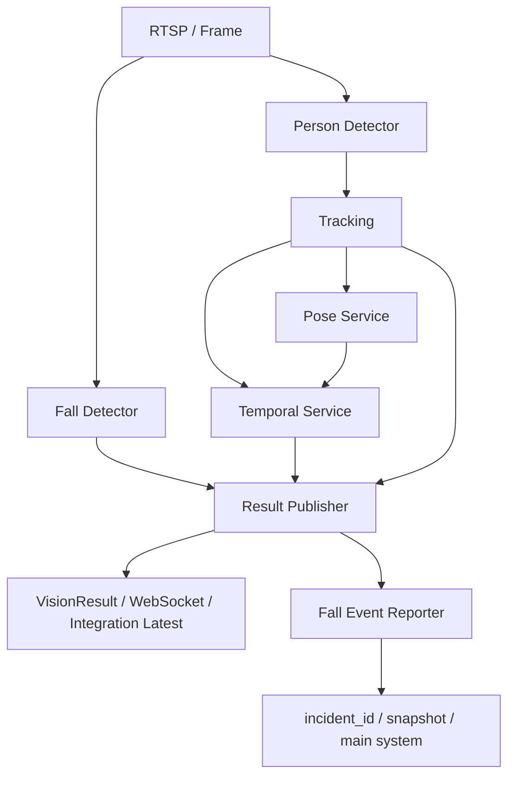

# Vision Service 楠ㄦ灦濮挎€佹娴嬩笌璺屽€掓娴嬮€昏緫鎶ュ憡

## 1. 鏂囨。鐩殑

杩欎唤鏂囨。鐢ㄤ簬绯荤粺鎬ц鏄?`vision_service` 涓細

1. 楠ㄦ灦濮挎€佹娴嬶紙Pose锛夊湪鏁存潯瑙嗚閾捐矾涓殑浣嶇疆銆?2. Pose 濡備綍褰卞搷璺屽€掓娴嬶紙Fall Detection锛夈€?3. 璺屽€掔粨鏋滄槸濡備綍鐢卞璺瘉鎹瀺鍚堝嚭鏉ョ殑銆?4. 褰撳墠绯荤粺閲?Pose銆乀racking銆乀emporal銆丗all Detector銆丷esult Layer 涔嬮棿鐨勮竟鐣屻€?5. 杩戞湡鎺掓煡涓凡缁忕‘璁ょ殑闂銆佸凡鍋氱殑淇濇姢锛屼互鍙婂悗缁渶瀹规槗缁х画鍑洪敊鐨勭偣銆?
杩欎唤鏂囨。閫傚悎浣滀负锛?
- 鏂板伐绋嬪笀鎺ユ墜鏉愭枡
- 鑱旇皟鍓嶇殑鏋舵瀯璇存槑
- 璇姤/婕忔姤鎺掓煡鐨勬€荤储寮?
---

## 2. 鏍稿績缁撹

褰撳墠绯荤粺涓嶆槸鈥滅函楠ㄦ灦璺屽€掓娴嬧€濓紝鑰屾槸鈥滃璇佹嵁铻嶅悎璺屽€掓娴嬧€濄€?
鏇村噯纭湴璇达細

- `Person Detector` 璐熻矗鍙戠幇浜恒€?- `Tracker` 璐熻矗缁欎汉鍒嗛厤 `track_id`锛屽苟缁存寔杩炵画韬唤銆?- `Pose` 璐熻矗缁欑洰鏍囪ˉ鍏呭叧閿偣銆佽函骞茶搴︺€佸ご/楂嬮珮搴︾瓑濮挎€佺壒寰併€?- `Temporal` 璐熻矗鎶?bbox 杩愬姩鐗瑰緛鍜屽Э鎬佺壒寰佹嫾鎴愭椂搴忕獥鍙ｃ€?- `Fall Detector` 璐熻矗缁欏綋鍓嶅抚杈撳嚭 `fall / fallen / lying` 绛夋彁绀恒€?- `Result Publisher` 璐熻矗铻嶅悎鏃跺簭缁撴灉銆乫all detector 缁撴灉鍜?field rule銆?- `Fall Event Reporter` 璐熻矗鎶?`fallen_confirmed` 鍙樻垚甯?`incident_id` 鐨勬寮忎簨浠躲€?
鎵€浠ワ細

- Pose 寰堥噸瑕侊紝浣嗕笉鏄敮涓€鍐冲畾鍥犵礌銆?- Pose 缂哄け鏃讹紝绯荤粺浠嶅彲鑳戒緷闈?bbox銆侀€熷害銆佹椂搴忋€乫all detector 杈撳嚭杩涜纭銆?- 鍙嶈繃鏉ワ紝鍗充娇 Pose 寰堝噯锛岃穼鍊掍篃涓嶄竴瀹氱‘璁わ紝鍥犱负纭閾捐矾杩樹緷璧栨椂搴忋€佸瓧娈佃鍒欏拰缁撴灉灞傝瀺鍚堛€?
---

## 3. 鐩稿叧浠ｇ爜浣嶇疆

### 3.1 Pose 鐩稿叧

- `D:\Program\vision_service\app\services\pose_service.py`
- `D:\Program\vision_service\app\pose\yolo_pose_estimator.py`
- `D:\Program\vision_service\app\pose\branch4_legacy_pose_estimator.py`
- `D:\Program\vision_service\app\pose\yolo11_legacy_pose_estimator.py`
- `D:\Program\vision_service\app\pose\schemas.py`

### 3.2 鏃跺簭涓庤穼鍊掔姸鎬佹満

- `D:\Program\vision_service\app\services\temporal_service.py`
- `D:\Program\vision_service\app\temporal\target_feature_extractor.py`
- `D:\Program\vision_service\app\temporal\fall_state_machine.py`
- `D:\Program\vision_service\app\temporal\mock_sequence_model.py`
- `D:\Program\vision_service\app\temporal\onnx_sequence_model.py`
- `D:\Program\vision_service\app\temporal\schemas.py`

### 3.3 缁撴灉铻嶅悎涓庝簨浠惰緭鍑?
- `D:\Program\vision_service\app\services\result_publisher_service.py`
- `D:\Program\vision_service\app\services\fall_event_reporter_service.py`
- `D:\Program\vision_service\app\services\tracking_worker_service.py`

---

## 4. 鎬讳綋鏁版嵁娴?

杩欐潯閾捐矾閲屾渶閲嶈鐨勪竴鐐规槸锛?
- Pose 涓嶇洿鎺ヨ緭鍑?`fallen_confirmed`銆?- Pose 鍏堣浆鎴愬Э鎬佺壒寰併€?- 濮挎€佺壒寰佸啀杩涘叆 `Temporal` 鎴?`Result Publisher` 鐨勮瀺鍚堥€昏緫銆?- 鏈€缁堢‘璁ゆ潈鍦?`Temporal + Result Fusion + Event Reporter`锛岃€屼笉鏄?Pose 鏈韩銆?
---

## 5. Pose 鍦ㄧ郴缁熶腑鐨勮亴璐?
## 5.1 Pose 杈撳嚭鍐呭

Pose 杈撳嚭鏈川涓婃槸缁?`DetectedObject` 琛ヤ竴涓?`pose` 瀛楁銆?
鍦?`pose_service.py` 涓紝鍗曚釜瀵硅薄浼氳琛ュ厖锛?
- `track_id`
- `source_track_id`
- `source_bbox`
- `pose_bbox`
- `pose_frame_seq`
- `pose_timestamp`
- `keypoints`
- `skeleton_confidence`
- `debug`

杩欐剰鍛崇潃 Pose 涓嶆槸涓€涓嫭绔嬪叏灞€缁撴灉锛岃€屾槸鎸傚湪姣忎釜 tracked person object 涓婄殑闄勫姞淇℃伅銆?
## 5.2 Pose 鐨勪富瑕佸伐绋嬩綔鐢?
Pose 鐩墠鎵挎媴 4 绫昏亴璐ｏ細

1. 缁欏墠绔?Overlay 鐢婚鏋躲€?2. 缁欐椂搴忔ā鍨嬭ˉ鍏呭Э鎬佺壒寰併€?3. 缁欑粨鏋滃眰鎻愪緵鈥滀綆濮挎€佲€濃€滆函骞茶搴︹€濃€滃彲瑙佸叧閿偣鈥濈瓑杈呭姪渚濇嵁銆?4. 鍦ㄥ浜哄満鏅噷浣滀负涓€涓渶瑕佸拰 `track_id` 寮虹粦瀹氱殑瀛愮粨鏋溿€?
## 5.3 Pose 涓嶈礋璐ｄ粈涔?
Pose 涓嶈礋璐ｏ細

- 鐩存帴鍙戝憡璀?- 鐩存帴鐢熸垚 `incident_id`
- 鍗曠嫭鍐冲畾 `fallen_confirmed`
- 鍗曠嫭鍐冲畾蹇収涓婁紶

---

## 6. Pose 濡備綍鍙樻垚璺屽€掔壒寰?
## 6.1 Feature Extractor 鐨勮緭鍏?
`TargetFeatureExtractor.extract()` 璇诲彇鐨勬槸鍗曚釜 `DetectedObject`銆?
瀹冧細浠?bbox 涓彁鍙栵細

- `bbox_center_x`
- `bbox_center_y`
- `bbox_width`
- `bbox_height`
- `aspect_ratio`
- `delta_x`
- `delta_y`
- `velocity_x`
- `velocity_y`
- `speed`

鍚屾椂涔熶細浠?`pose` 涓彁鍙栧Э鎬佹寚鏍囥€?
## 6.2 Pose 瀵煎嚭鐨勬牳蹇冨Э鎬佹寚鏍?
鍦?`target_feature_extractor.py` 涓紝Pose 缁忚繃 `_pose_metrics()` 鍚庝富瑕佷骇鍑猴細

- `pose_available`
- `pose_confidence`
- `torso_angle`
- `hip_height_ratio`
- `head_height_ratio`

### 杩欎簺鍊肩殑鍚箟

`pose_available`

- 褰撳墠瀵硅薄鏄惁鏈夊彲鐢ㄥ叧閿偣銆?- 鍏抽敭鐐瑰繀椤绘弧瓒?`confidence >= 0.2` 鎵嶅弬涓庤绠椼€?
`torso_angle`

- 鐢辫偐閮ㄤ腑蹇冨埌楂嬮儴涓績鐨勫悜閲忚绠椼€?- 鍙敤浜庡尯鍒嗙洿绔嬨€佸集鑵般€佸€掑湴绛夊Э鎬佸彉鍖栥€?
`hip_height_ratio`

- 楂嬮儴 y 鐩稿 bbox 椤堕儴鐨勫綊涓€鍖栦綅缃€?- 瓒婇潬杩?bbox 涓嬫柟锛屽€艰秺澶с€?
`head_height_ratio`

- 澶撮儴 y 鐩稿 bbox 椤堕儴鐨勫綊涓€鍖栦綅缃€?- 澶撮潬杩?bbox 涓笅閮ㄦ椂锛岃鏄庝汉浣撳彲鑳藉浜庝綆濮挎€佹垨妯汉銆?
## 6.3 涓轰粈涔堣繖浜涙寚鏍囬噸瑕?
褰撳墠鏃跺簭鐘舵€佹満瀵光€滀綆濮挎€佲€濈殑鍒ゆ柇骞朵笉鍙湅 bbox 瀹介珮姣旓紝杩樹細鍙傝€冨Э鎬佺偣锛?
- `low_by_bbox = aspect_ratio >= 0.95`
- `low_by_pose = head_height_ratio > 0.45 and hip_height_ratio > 0.65`

涔熷氨鏄锛?
- 濡傛灉浜烘í鍚戣汉涓嬶紝bbox 鍙樺锛宍aspect_ratio` 浼氬崌楂樸€?- 濡傛灉 bbox 娌℃湁鐗瑰埆瀹斤紝浣嗗叧閿偣鏄剧ず澶村拰楂嬮兘宸茬粡寰堜綆锛屼粛鐒跺彲鑳借鍒ゆ垚浣庡Э鎬併€?
鎵€浠?Pose 鐨勪环鍊煎湪杩欓噷鏈€鐩存帴锛?
- 瀹冩槸 bbox 浣庡Э鎬佸垽鏂殑琛ュ厖璇佹嵁銆?- 瀹冨彲浠ュ府鍔╁尯鍒嗏€滃集鑵?鍧愮潃鈥濆拰鈥滅湡姝ｅ€掑湴鈥濄€?
---

## 7. Temporal Service 濡備綍浣跨敤 Pose

## 7.1 Temporal 鐨勬湰璐?
`TemporalService` 浼氫负姣忎釜瀵硅薄寤虹珛涓€涓椂搴忕獥鍙ｃ€?
瀹冭鍙栫殑涓嶆槸鈥滆８鍏抽敭鐐光€濓紝鑰屾槸宸茬粡缁撴瀯鍖栧悗鐨?`TargetFeature`銆?
鎹㈠彞璇濊锛?
- 鍘熷鍏抽敭鐐逛笉浼氱洿鎺ラ€佸叆鐘舵€佹満銆?- 鐪熸杩涘叆鐘舵€佹満鐨勬槸 `bbox + 閫熷害 + low_posture + torso_angle + hip/head ratio` 杩欑鍘嬬缉鍚庣殑鐗瑰緛銆?
## 7.2 Temporal 鐨勫叧閿緭鍑?
Temporal 瀵瑰崟涓璞′細鐢熸垚锛?
- `temporal.fall_probability`
- `temporal.low_posture`
- `temporal.body_angle`
- `temporal.bbox_aspect_ratio`
- `temporal.velocity_y`
- `temporal.stillness`
- `temporal.candidate_duration_ms`
- `temporal.confirm_duration_ms`
- `temporal.rejected_reason`

鍚屾椂杩樹細鐢熸垚锛?
- `fall_decision`
- `alarm_preview`

鍏朵腑 `fall_decision.source = "temporal_state_machine"`銆?
## 7.3 褰撳墠鐘舵€佹満鐨勭‘璁ゆ€濊矾

`fall_state_machine.py` 涓紝鏃跺簭鐘舵€佹祦澶ц嚧鏄細

- `normal`
- `unstable`
- `falling`
- `fallen_candidate`
- `fallen_confirmed`
- `cooldown`

纭璺屽€掗€氬父闇€瑕佸悓鏃舵弧瓒筹細

- 鏈€杩戞湁鏄庢樉涓嬭惤 `delta_y`
- `fall_probability` 瓒冲楂?- `low_posture = true`
- `stillness = true`
- 鎸佺画鏃堕棿鍜岀‘璁ゅ抚鏁拌揪鍒伴槇鍊?
鎵€浠?Pose 鐨勪綔鐢ㄦ洿鍍忥細

- 澧炲己 `low_posture`
- 鎻愪緵 `torso_angle`
- 鏀瑰杽鈥滃綋鍓嶆槸鍚︾湡鐨勮洞/韬衡€濈殑鍒ゆ柇

浣嗗鏋滐細

- `delta_y` 涓嶅
- `stillness` 涓嶅
- 鍊欓€夋寔缁椂闀夸笉澶?
閭ｄ箞 Pose 鍐嶅噯锛屼篃鍙兘涓嶄細 confirmed銆?
---

## 8. Result Publisher 涓殑涓夋潯璺屽€掔‘璁よ矾寰?
`result_publisher_service.py` 鏄暣鏉¤穼鍊掔粨鏋滈€昏緫鏈€鍏抽敭鐨勮瀺鍚堝眰銆?
褰撳墠鑷冲皯鏈?3 鏉′笌璺屽€掓湁鍏崇殑璺緞锛?
## 8.1 璺緞 A锛歍emporal State Machine

鏉ユ簮锛?
- `temporal_service.enrich()`

鐗瑰緛锛?
- 鏉ユ簮绋冲畾
- 渚濊禆鏃跺簭绐楀彛
- 鏇撮€傚悎鈥滅湡瀹炶穼鍊掕繃绋嬧€濈殑纭

缁撴灉鏍囪锛?
- `fall_decision.source = temporal_state_machine`

## 8.2 璺緞 B锛欶all Detector Strong Label

鏉ユ簮锛?
- `STRONG_FALL_LABELS = {"fall", "fallen"}`
- `_merge_fall_detection()`

閫昏緫锛?
- 濡傛灉褰撳墠浜烘鍜?fall detector 妗?IoU 鍖归厤
- 涓?`label in {"fall", "fallen"}`
- 鍒欒繘鍏?detector-only candidate / confirm 閫昏緫

缁撴灉鏍囪锛?
- `source = yolo_fall_detector`
- `confirm_source = fall_detector_continuous_candidate`

杩欐槸杩囧幓鏈€瀹规槗瀵艰嚧璇姤鐨勪竴鏉¤矾寰勩€?
## 8.3 璺緞 C锛欶ield Fall Candidate Fusion

鏉ユ簮锛?
- `_merge_field_fall_candidates()`

瀹冩洿鍍忎竴涓€滅粨鏋滃眰淇濆簳铻嶅悎鍣ㄢ€濓細

- 涓嶄竴瀹氫緷璧栧綋鍓嶅抚 strong fall object
- 鍙兘鍒╃敤 recent strong hint銆佷綆濮挎€?bbox銆佺ǔ瀹?track銆乸erson evidence銆乼emporal confirm evidence 鏉ョ‘璁?
缁撴灉鏍囪锛?
- `source = field_fall_candidate_fusion`
- `confirm_source = field_low_posture_recent_fall_hint`

杩欐潯璺緞涓嶆槸 Pose 涓撳睘锛屼絾浼氬ぇ閲忎娇鐢細

- `bbox_aspect_ratio`
- `pose_available`
- `body_angle`
- `low_posture`
- `stillness`
- `velocity_y`

---

## 9. Pose 鍦ㄤ笁鏉¤矾寰勪腑鐨勫弬涓庢柟寮?
| 璺緞 | Pose 鏄惁鐩存帴鍙備笌 | Pose 浣滅敤鏂瑰紡 |
|---|---|---|
| Temporal State Machine | 鏄?| 閫氳繃 `pose_available / torso_angle / hip_height_ratio / head_height_ratio` 褰卞搷 `low_posture` 鍜岃涓哄垽鏂?|
| Detector-only Confirm | 闂存帴 | 浣滀负 `person evidence` 鎴?`low_posture` 鐨勮緟鍔╀俊鎭紝浣嗕笉鏄富璇佹嵁 |
| Field Rule Fusion | 闂存帴涓旈噸瑕?| 褰卞搷 `pose_available`銆佷綆濮挎€佸垽鏂€佸瓧娈佃В閲婂拰 debug |

鏍稿績鐞嗚В锛?
- Pose 鍦?Temporal 閲屾洿鍍忊€滅壒寰佽緭鍏モ€濄€?- Pose 鍦?Result Publisher 閲屾洿鍍忊€滆緟鍔╄瘉鎹€濆拰鈥滆В閲婂瓧娈碘€濄€?- Pose 鍑犱箮浠庝笉鍗曠嫭鎵挎媴鈥滄渶缁堢‘璁ゆ潈鈥濄€?
---

## 10. Pose 涓?Tracking 鐨勫己缁戝畾鍏崇郴

## 10.1 涓轰粈涔堝繀椤荤粦瀹?`track_id`

澶氫汉鍦烘櫙閲岋紝濡傛灉 Pose 缁撴灉娌℃湁鍜?object 鐨?`track_id` 涓ユ牸缁戝畾锛屽氨浼氬嚭鐜帮細

- A 浜?bbox + B 浜洪鏋?- 鏂?bbox + 鏃?pose
- 楠ㄦ灦椋炲埌绌轰腑
- 涓€涓汉鐨勯鏋惰骞挎挱鍒版墍鏈変汉

## 10.2 褰撳墠缁戝畾淇濇姢

褰撳墠鍚庣宸茬粡鏈夊灞備繚鎶わ細

- `pose.track_id`
- `pose.source_track_id`
- `pose.source_bbox`
- `pose_frame_seq`
- `pose_timestamp`

鍦?`result_publisher_service.py` 涓紝濡傛灉锛?
- `pose_track_id != object.track_id`
- 鎴?`source_track_id != object.track_id`

鍒欑洿鎺ユ嫆缁濓細

- `rejected_reason = pose_track_mismatch`
- `keypoints = []`

杩欐剰鍛崇潃锛?
- bbox 杩樿兘鏄剧ず
- 楠ㄦ灦浼氳闅愯棌
- 涓嶄細鍐嶇‖璐撮敊浣嶉鏋?
---

## 11. Pose 缁撴灉鐨勬椂鏁堟€ч棶棰?
Pose 涓嶆槸姣忎竴甯ч兘璺戙€?
褰撳墠绯荤粺閲岋細

- Detection / Tracking 棰戠巼閫氬父楂樹簬 Pose
- Pose 鍙兘鍥犱负蹇欍€佹參銆佺啍鏂€乀TL 杩囨湡鑰岀己澶?
鎵€浠ョ郴缁熷繀椤诲鐞嗭細

- `pose_frame_age_ms`
- `pose_tracking_seq_delta`
- `pose_frame_stale`
- `pose_frame_desync`

杩欑被闂鐨勫鐞嗗師鍒欐槸锛?
- 瀹佸彲涓嶆樉绀洪鏋?- 涔熶笉瑕佹妸杩囨湡楠ㄦ灦寮鸿创鍦ㄦ柊 bbox 涓?
杩欐潯鍘熷垯鍚屾牱褰卞搷璺屽€掓娴嬶細

- Pose stale 鏃讹紝鍓嶇涓嶅簲鐢婚鏋?- 鍚庣涔熶笉搴旇鎶婅繃鏃堕鏋剁户缁綋浣滄湁鏁堝Э鎬佽瘉鎹?
---

## 12. 浣庣疆淇″叧閿偣涓轰粈涔堜細姹℃煋璺屽€掓娴?
杩欐槸姝ゅ墠楠ㄦ灦鑵块儴椋樸€乸ose_bounds 姹℃煋鐨勬牴鍥犱箣涓€銆?
闂鏈川锛?
- 妯″瀷鍙兘杈撳嚭 `x=0` 鎴栬创杈圭偣
- 鎴栬緭鍑洪潪甯镐綆缃俊搴︾殑鑶濈洊/鑴氳笣
- 濡傛灉杩欎簺鐐硅褰撴垚鏈夋晥鐐瑰弬涓?`pose_bounds` 鎴栧悗缁Э鎬佺壒寰?- 灏变細瀵艰嚧鑵块儴椋炵嚎銆乥ounds 澶辩湡銆佺敋鑷冲奖鍝嶄綆濮挎€佸垽鏂?
褰撳墠椤圭洰宸茬粡鍋氳繃鐨勫叧閿慨澶嶆€濊矾鏄細

- `confidence >= 0.2`
- 杈圭晫鐐逛笉杩囨护涓嶅弬涓?bounds
- 浣庣疆淇¤吙鐐逛笉鍙備笌鑵块儴杩炵嚎
- `pose_bounds` 鍙敤鏈夋晥鐐硅绠?
杩欒鏄庯細

- Pose 涓嶆槸鈥滃彧褰卞搷鏄剧ず鈥?- 瀹冧篃浼氬奖鍝嶈穼鍊掑垽鏂墠鐨勭壒寰佽川閲?
---

## 13. Detector-only Confirm 鐨勫巻鍙查棶棰?
杩欎竴灞傛槸鏈€杩戞渶鍏抽敭鐨勮鎶ユ潵婧愪箣涓€銆?
杩囧幓鐨勯棶棰樻槸锛?
- fall detector 杈撳嚭 `fall`
- bbox 瀹為檯杩樻槸鐩寸珛浜?- 缁撴灉灞備粛鐒惰繛缁疮璁″苟鐩存帴 confirmed

浜庢槸鍑虹幇锛?
- 绔欑潃鐨勪汉鏄剧ず `Fall Confirmed`
- 璧疯韩鍚庝粛鐒惰缁х画 confirmed
- 鍚屼竴鍔ㄤ綔鐢熸垚澶氫釜 `incident_id`

## 13.1 褰撳墠宸插姞鐨勪繚鎶?
鍦?`_fall_detector_confirmed()` 涓紝宸茬粡鏂板浜?`detector_only_upright_guard`銆?
瀹冧細妫€鏌ワ細

- `bbox_aspect_ratio`
- `temporal.low_posture`
- `behavior_state`
- `temporal_confirm_evidence`

绠€鍖栫悊瑙ｏ細

- 濡傛灉褰撳墠浠嶅儚鐩寸珛浜?- 涓旀病鏈変綆濮挎€?鏃跺簭纭鏀拺
- 閭ｄ箞 `fall` 鏍囩涓嶈兘鐩存帴鍙樻垚 `fallen_confirmed`

鍙細锛?
- 鍋滃湪 candidate
- 杈撳嚭 `rejected_reason = detector_only_upright_guard`
- 闄勫甫 `detector_only_debug`

## 13.2 杩欏眰淇濇姢鍜?Pose 鐨勫叧绯?
瀹冧笉鏄函 Pose 淇濇姢锛屼絾 Pose 浼氬奖鍝嶈繖灞?guard 鏄惁鏀捐锛?
- 濡傛灉 Pose 鏀寔浣庡Э鎬?- 鍒欐洿瀹规槗閫氳繃鈥滈潪鐩寸珛鈥濆垽瀹?
濡傛灉 Pose 缂哄け锛屽垯鍙兘渚濊禆锛?
- bbox 瀹介珮姣?- temporal low posture
- behavior state

---

## 14. Field Rule 涓?Pose 鐨勫叧绯?
Field Rule 鐩墠鏄渶瀹规槗琚瑙ｇ殑涓€灞傘€?
瀹冧笉鏄€滃湴闈㈣鍒欌€濓紝鑰屾槸鈥滅粨鏋滃眰浣庡Э鎬佺‘璁よ瀺鍚堣鍒欌€濄€?
瀹冧細缁煎悎锛?
- `has_recent_strong_hint`
- `has_current_fall_object`
- `has_current_strong_fall_object`
- `has_temporal_confirm_evidence`
- `aspect_pass`
- `center_y_pass`
- `height_pass`
- `window_size_pass`
- `speed_pass`
- `stable_track_pass`
- `person_evidence_pass`
- `pose_available`
- `body_angle`
- `low_posture`
- `stillness`
- `velocity_y`

杩欐剰鍛崇潃锛?
- Pose 浼氳繘鍏?`pose_available / body_angle / low_posture`
- 浣?Field Rule 涓嶆槸鈥滄湁 Pose 灏辩‘璁も€?- 鑰屾槸澶氭潯浠剁患鍚?
杩欎篃鏄负浠€涔堬細

- 鏈夋椂绔欑珛鏃朵笉浼氳 detector-only confirmed
- 浣嗗鏋?temporal 鎴?field rule 鎶娾€滀綆濮挎€佲€濊鍒や簡锛屼粛鍙兘浠庡埆鐨勮矾寰?confirmed

鏈€杩戠湡浜哄楠岄噷宸茬粡鐪嬪埌锛?
- detector-only guard 鐢熸晥浜?- 浣嗕粛鍙兘鐢?`field_fall_candidate_fusion` 鎴?`temporal_state_machine` 鍦ㄩ敊璇獥鍙ｇ‘璁?
鎵€浠ュ悗缁帓鏌ヤ笉鑳藉彧鐩潃 detector-only銆?
---

## 15. 浜嬩欢杈撳嚭灞備笌 Pose/Fall 鐨勫叧绯?
褰撳璞¤繘鍏?`fallen_confirmed` 鍚庯紝`FallEventReporterService` 浼氬仛 3 浠朵簨锛?
1. 鐢熸垚 `incident_id`
2. 鐢熸垚蹇収 `snapshot_url / snapshot_path`
3. 鎺ㄩ€佸埌涓荤郴缁熸垨杞缂撳瓨

杩欏眰涓嶅叧蹇冮鏋剁敾寰楀ソ涓嶅ソ鐪嬶紝瀹冨彧鍏冲績锛?
- 褰撳墠瀵硅薄鏄惁 confirmed
- 鏄惁鏈?person evidence
- 鏄惁鍛戒腑 dedup / cooldown key

褰撳墠浜嬩欢鍘婚噸閫昏緫宸茬粡浠庘€滅函绌洪棿鏍煎瓙鈥濇敹绱у埌锛?
- 浼樺厛 `camera_id + track_id`
- 鍏舵 `camera_id + person_id`
- 鏈€鍚庢墠 fallback 鍒扮矖绮掑害绌洪棿 key

浣嗘渶杩戠湡浜哄楠屼篃璇存槑浜嗕竴涓柊闂锛?
- 濡傛灉鍚屼竴娆″€掑湴淇濇寔鏈熼棿 `track_id` 鍙戠敓鍒囨崲
- 浠嶅彲鑳界敓鎴愪袱涓?`incident_id`

杩欒鏄庡綋鍓?incident 鍘婚噸杩橀渶瑕佽法 track 鐨勨€滃悓涓€ fallen hold 鍚堝苟鈥濊兘鍔涖€?
---

## 16. 褰撳墠绯荤粺涓?Pose 涓?Fall 鐨勭湡瀹炲叧绯?
杩欎竴鐐瑰繀椤昏娓呮锛屽惁鍒欏伐绋嬩笂寰堝鏄撹鍒ゃ€?
### 16.1 Pose 涓嶆槸璺屽€掓娴嬩富骞?
褰撳墠涓诲共浠嶇劧鏄細

- 浜烘
- 閫熷害
- 浣庡Э鎬?- 鏃跺簭鎸佺画鎬?- fall detector 鎻愮ず

Pose 鏇村鏄寮洪」銆?
### 16.2 Pose 閿欎簡锛屼笉涓€瀹氫細璇姤璺屽€?
濡傛灉锛?
- detector-only guard 鐢熸晥
- temporal 浣庡Э鎬佷笉鎴愮珛
- field rule 鏉′欢涓嶆弧瓒?
閭ｄ箞 Pose 宸篃鍙兘鍙槸鈥滈鏋朵笉濂界湅鈥濓紝涓嶄竴瀹氱洿鎺ヨ鎶ャ€?
### 16.3 Pose 鍑嗕簡锛屼篃涓嶄竴瀹氫細纭璺屽€?
濡傛灉锛?
- 浜哄揩閫熻捣韬?- stillness 涓嶅
- candidate_duration 涓嶅
- track 涓㈠け

閭ｄ箞鍗充娇楠ㄦ灦鍑嗙‘锛岃穼鍊掍粛鍙兘鍙埌 `fallen_candidate`銆?
### 16.4 鐪熸鐨勮穼鍊掔‘璁ゆ槸澶氭ā鍧楀叡鍚岀粨鏋?
鍙互鎶婂綋鍓嶇郴缁熺湅鎴愶細

- Pose 瑙ｅ喅鈥滀汉鐜板湪鍍忎笉鍍忓€掑湴鈥?- Temporal 瑙ｅ喅鈥滆繖涓繃绋嬪儚涓嶅儚璺屽€掆€?- Result Layer 瑙ｅ喅鈥滃綋鍓嶆槸鍚﹁冻澶熺‘璁も€?- Event Layer 瑙ｅ喅鈥滄槸鍚﹀彂姝ｅ紡浜嬫晠鈥?
---

## 17. 鍘嗗彶涓婂凡缁忚俯杩囩殑涓昏鍧?
## 17.1 bbox 姝ｅ父浣?pose 鍋忕Щ

鏍瑰洜绫诲瀷锛?
- 鏃?Pose 璐存柊 bbox
- track 缁戝畾閿?- cache 澶嶇敤閿?
鍚庢灉锛?
- 楠ㄦ灦鐢诲埌鍒汉韬笂
- 楠ㄦ灦椋炲嚭浜轰綋

## 17.2 姝ｅ父鐘舵€佹樉绀虹孩鑹?
鏍瑰洜绫诲瀷锛?
- 鏂囨湰璇?`fall_state`
- 棰滆壊鍗磋 `risk_level`

鍚庢灉锛?
- `normal` 鏂囨湰 + 绾㈣壊妗?
## 17.3 鏃犱汉鐢婚潰浠嶇劧 confirmed

鏍瑰洜绫诲瀷锛?
- fall-only box 琚彁鍗囨垚 person
- detector-only confirm 缂哄皯 person evidence

鍚庢灉锛?
- 鏃犱汉涔熸湁 `fallen_confirmed + incident_id`

## 17.4 鍧愬Э璇‘璁?
鏍瑰洜绫诲瀷锛?
- recent strong hint 娈嬬暀
- field confirm 鍙寜绌洪棿缃戞牸绱

鍚庢灉锛?
- 鍧愬Э涔熻兘 confirmed

## 17.5 绔欑珛璇‘璁?
鏍瑰洜绫诲瀷锛?
- detector-only confirm 娌℃湁鐩寸珛淇濇姢

鍚庢灉锛?
- 绔欑潃鐨勪汉琚?`Fall Confirmed`

## 17.6 鍚屼竴娆¤穼鍊掑涓?incident

鏍瑰洜绫诲瀷锛?
- dedup key 澶矖鎴栧お渚濊禆 track
- 鍚屼竴娆?fallen hold 鏈熼棿 track 鍒囨崲

鍚庢灉锛?
- 鍚屼竴鍔ㄤ綔鐢熸垚澶氫釜 `incident_id`

---

## 18. 褰撳墠宸茬粡瀛樺湪鐨勯噸瑕佷繚鎶?
### Pose 渚?
- `pose_track_mismatch` 鐩存帴鎷掔粷
- stale pose 涓嶇敾楠ㄦ灦
- 浣庣疆淇＄偣杩囨护
- 杈圭晫鐐逛笉鍙備笌 bounds

### Result Layer 渚?
- `detector_only_no_person_evidence`
- `detector_only_upright_guard`
- `field_recent_hint_blocked_no_current_fall_object`
- `field_confirm_requires_stable_person_evidence`
- `field_confirm_blocked_possible_sitting`

### Temporal 渚?
- `no_objects_reset_temporal`
- cooldown
- candidate duration / confirm frames

### Event 渚?
- `incident_identity_key` 浼樺厛鎸?`camera_id + track_id`
- cooldown 鍐呬簨浠跺鐢?
---

## 19. 褰撳墠鏈€鍊煎緱鍏虫敞鐨勬湭瀹屽叏闂幆闂

## 19.1 Pose 浠嶇劧涓嶆槸鎵€鏈夋紡鎶?璇姤鐨勯鍥?
鐜板湪鏈€鍗遍櫓鐨勮鍖烘槸锛?
- 鐪嬪埌楠ㄦ灦涓嶇ǔ锛屽氨璁や负璺屽€掕鎶ヤ竴瀹氭槸 Pose 寮曡捣

瀹為檯涓婅繎鏈熷楠屽凡缁忚瘉鏄庯細

- detector-only 璇‘璁よ兘琚慨鎺?- 浣?temporal / field rule / incident dedup 浠嶅彲鑳藉崟鐙嚭闂

## 19.2 褰撳墠鏈畬鍏ㄨВ鍐崇殑鏄法 track incident dedup

鏈€鏂扮湡浜哄楠岄噷宸茬粡鐪嬪埌锛?
- `Fall Confirmed` 鍙戠敓鍦ㄥ€掑湴淇濇寔娈碉紝鏃堕棿鐐规槸鍚堢悊鐨?- 浣嗘槸鍚屼竴娆?fallen hold 鏈熼棿锛宍track_id` 浠?2 鍒囧埌 1
- 瀵艰嚧鐢熸垚涓や釜 `incident_id`

杩欒鏄庡綋鍓嶄笅涓€浼樺厛绾у簲鏄細

- 鈥滃悓涓€鍊掑湴淇濇寔鏈熲€濈殑璺?track 鍚堝苟

鑰屼笉鏄户缁洖澶磋皟 Pose銆?
## 19.3 褰撳墠 Pose provider 涓?runtime 浠嶉渶娉ㄦ剰

绯荤粺鏀寔澶氫釜 Pose provider锛?
- `yolo`
- `yolo11_legacy`
- `branch4_legacy`
- `rtmpose_onnx`
- `mmpose`

浣嗕笉鍚?provider 瀵癸細

- bbox crop 鏂瑰紡
- 鍏ㄥ抚/鍗曠洰鏍囩瓥鐣?- smoothing
- keypoint filter
- 鎭㈠鍧愭爣鏂瑰紡

閮芥湁宸紓銆?
鍚庣画浠讳綍鈥淧ose 閫€鍖栤€濋棶棰橈紝閮藉繀椤诲厛纭锛?
- 褰撳墠鍒板簳璺戠殑鏄摢涓?provider
- 褰撳墠 runtime profile 鏄粈涔?- temporal 鏄惁鍚敤
- model provider 鏄?`mock / shadow / onnx_lstm` 涓摢涓?
---

## 20. 寤鸿鐨勬柊宸ョ▼甯堥槄璇婚『搴?
寤鸿鎸変笅闈㈤『搴忕悊瑙ｇ郴缁燂細

1. 鍏堣 `app/services/result_publisher_service.py`
   鐩爣锛氱悊瑙ｆ渶缁堜负浠€涔堜細 confirmed銆?
2. 鍐嶈 `app/services/temporal_service.py`
   鐩爣锛氱悊瑙ｆ椂搴忕壒寰佹槸鎬庝箞鏉ョ殑銆?
3. 鍐嶈 `app/temporal/fall_state_machine.py`
   鐩爣锛氱悊瑙?`normal -> candidate -> confirmed` 鐨勭姸鎬佽浆绉汇€?
4. 鍐嶈 `app/temporal/target_feature_extractor.py`
   鐩爣锛氱悊瑙?Pose 鍒版椂搴忕壒寰佺殑鏄犲皠銆?
5. 鏈€鍚庤 `app/services/pose_service.py`
   鐩爣锛氱悊瑙?Pose 鏄浣曟寕鍒?tracked object 涓婄殑銆?
濡傛灉鏄帓澶氫汉楠ㄦ灦閿欎綅闂锛屽啀琛ヨ锛?
- `app/services/tracking_worker_service.py`
- `app/pose/branch4_legacy_pose_estimator.py`

濡傛灉鏄帓璇姤浜嬩欢闂锛屽啀琛ヨ锛?
- `app/services/fall_event_reporter_service.py`

---

## 21. 鍚庣画鎺掓煡寤鸿

### 濡傛灉鏄鏋堕敊浣?
浼樺厛鏌ワ細

- `track_id`
- `source_track_id`
- `pose_frame_seq`
- `pose_frame_age_ms`
- `pose_track_match_score`
- `rejected_reason`

### 濡傛灉鏄珯绔嬭鎶?
浼樺厛鏌ワ細

- `fall_decision.source`
- `confirm_source`
- `detector_only_debug`
- `field_rule_debug`
- `temporal.low_posture`

### 濡傛灉鏄€掑湴涓嶇‘璁?
浼樺厛鏌ワ細

- `candidate_duration_ms`
- `confirm_duration_ms`
- `fall_probability`
- `stillness`
- `velocity_y`
- `raw_person_count`
- `tracked_objects_count`

### 濡傛灉鏄涓?incident

浼樺厛鏌ワ細

- `track_id` 鏄惁鍒囨崲
- `incident_identity_key`
- `incident_spatial_key`
- cooldown 鏄惁鍛戒腑
- 鍚屼竴 fallen hold 鏄惁琚垎鎴愬涓?object

---

## 22. 鎬荤粨

褰撳墠 `vision_service` 涓紝Pose 涓庤穼鍊掓娴嬬殑鍏崇郴鍙互姒傛嫭涓轰竴鍙ヨ瘽锛?
> Pose 涓嶆槸璺屽€掔‘璁ゅ櫒锛岃€屾槸璺屽€掔‘璁ょ殑楂樹环鍊艰緟鍔╄瘉鎹簮銆?
瀹冩渶閲嶈鐨勪环鍊煎湪浜庯細

- 鎶娾€滃儚涓嶅儚鍊掑湴鈥濅粠绾?bbox 鍒ゆ柇锛屾彁鍗囧埌鈥渂box + 濮挎€佲€濊仈鍚堝垽鏂€?- 甯姪鏃跺簭妯″瀷鐞嗚В浜轰綋鏄惁鐪熺殑澶勪簬浣庡Э鎬併€?- 甯姪缁撴灉灞傝В閲婁负浠€涔堝€欓€夎鏀捐鎴栬鎷︽埅銆?
浣嗙郴缁熸渶缁堟槸鍚?`fallen_confirmed`锛屼粛鍙栧喅浜庯細

- tracking 鏄惁绋冲畾
- temporal window 鏄惁杩炵画
- low posture/stillness 鏄惁鎸佺画鎴愮珛
- fall detector 鏄惁缁欏嚭褰撳墠甯ф彁绀?- field rule 鏄惁鏀捐
- incident 灞傛槸鍚︽纭幓閲?
鎵€浠ュ伐绋嬩笂鏈€閲嶈鐨勫師鍒欐槸锛?
1. 涓嶈鎶婃墍鏈夎鎶ラ兘褰掑洜鍒?Pose銆?2. 涓嶈鎶婇鏋舵樉绀烘晥鏋滃拰璺屽€掔‘璁ょ粨鏋滄贩涓轰竴璋堛€?3. 鎺掓煡蹇呴』娌跨潃 `tracking -> pose -> temporal -> result fusion -> incident` 鐨勯『搴忕湅銆?4. 鏂板淇鏃惰鏄庣‘鑷繁鏄湪淇摢涓€灞傦紝涓嶈璺ㄥ眰璇激宸茬粡绋冲畾鐨勯€昏緫銆?
