# Vision Service 图解版系统说明

更新时间：2026-07-06

本文档用图解方式说明当前 Vision Service 项目做了什么、用了哪些技术、有哪些模型、实时链路怎么走、跌倒告警如何产生，以及当前架构中哪些地方可能成为性能瓶颈。

## 1. 一句话理解当前系统

当前系统是一个独立的实时视觉服务：

```text
从摄像头拉取实时画面
-> 用多个视觉模型分析老人是否跌倒
-> 将结果显示在前端
-> 确认跌倒后推送给主系统
-> 主系统产生跌倒告警弹窗
```

当前实际接入关系：

```text
摄像头: 192.168.8.250
Vision Service: 192.168.8.249:8000
主系统: 192.168.8.248:8000
```

## 2. 系统全景图

```mermaid
flowchart LR
    Camera["摄像头<br/>RTSP: 192.168.8.250"] --> Capture["采集模块<br/>Capture Worker"]
    Capture --> Buffer["最新帧缓存<br/>FrameBuffer"]

    Buffer --> FrontendVideo["前端实时画面<br/>/demo + WebRTC/JPEG"]
    Buffer --> PersonModel["人体检测模型<br/>YOLOv8n"]
    Buffer --> FallHintModel["跌倒提示模型<br/>YOLO Fall Hint"]

    PersonModel --> StoreDetection["RealtimeResultStore<br/>latest_detection"]
    FallHintModel --> StoreFall["RealtimeResultStore<br/>latest_fall_detection"]

    StoreDetection --> Tracking["目标跟踪<br/>ByteTrack"]
    Tracking --> StoreTracking["RealtimeResultStore<br/>latest_tracking"]

    StoreTracking --> PoseModel["姿态估计<br/>YOLO11 Pose"]
    PoseModel --> StorePose["RealtimeResultStore<br/>latest_pose"]

    StoreTracking --> Publisher["结果发布与融合<br/>ResultPublisherService"]
    StoreFall --> Publisher
    StorePose --> Publisher

    Publisher --> Temporal["时序模型<br/>ONNX LSTM"]
    Temporal --> Fusion["跌倒融合判断<br/>Fall Fusion"]
    Fusion --> LatestResult["最新结构化结果<br/>latest_published_result"]

    LatestResult --> Demo["演示前端<br/>http://192.168.8.249:8000/demo"]
    LatestResult --> API["集成接口<br/>/integration/results/..."]
    LatestResult --> WS["WebSocket<br/>/ws/results"]

    Fusion --> Reporter["告警上报<br/>FallEventReporter"]
    Reporter --> MainSystem["主系统<br/>192.168.8.248:8000"]
    MainSystem --> Popup["主系统前端<br/>跌倒弹窗"]
```

## 3. 技术栈地图

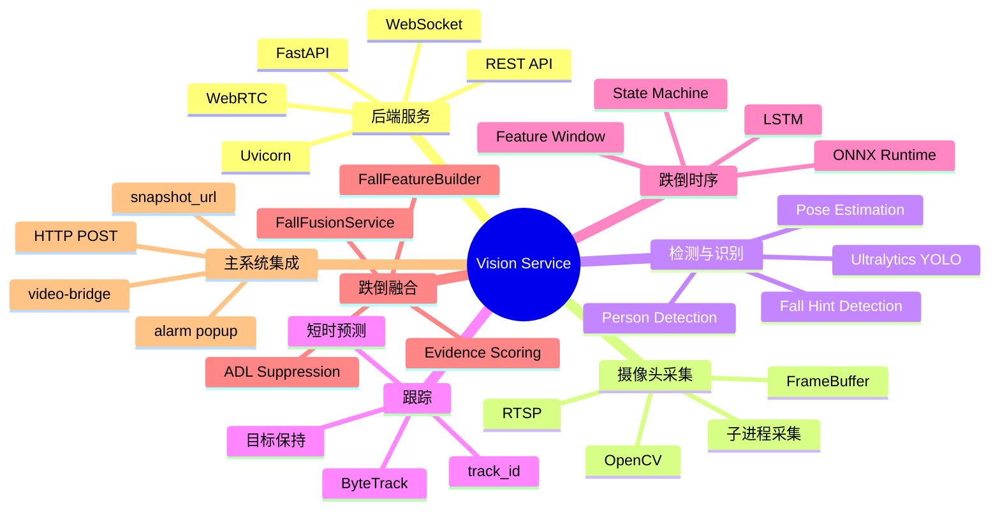

## 4. 当前实现了哪些功能

```mermaid
flowchart TB
    System["Vision Service 当前功能"] --> CameraFeature["摄像头接入"]
    System --> RealtimeFeature["实时画面"]
    System --> AIFeature["AI 分析"]
    System --> AlertFeature["跌倒告警"]
    System --> IntegrationFeature["主系统集成"]
    System --> DebugFeature["状态诊断"]
    System --> IdentityFeature["身份能力预留"]

    CameraFeature --> F1["RTSP 拉流"]
    CameraFeature --> F2["断流/卡顿状态监测"]
    CameraFeature --> F3["最新帧缓存"]

    RealtimeFeature --> F4["/demo 前端页面"]
    RealtimeFeature --> F5["WebRTC 视频"]
    RealtimeFeature --> F6["/stream/latest-frame.jpg"]

    AIFeature --> F7["人体检测"]
    AIFeature --> F8["跌倒提示检测"]
    AIFeature --> F9["目标跟踪"]
    AIFeature --> F10["姿态估计"]
    AIFeature --> F11["时序跌倒判断"]
    AIFeature --> F12["多证据融合"]

    AlertFeature --> F13["确认跌倒"]
    AlertFeature --> F14["保存跌倒截图"]
    AlertFeature --> F15["生成 incident_id"]
    AlertFeature --> F16["推送主系统"]

    IntegrationFeature --> F17["/integration/results"]
    IntegrationFeature --> F18["/integration/fall-alerts/poll"]
    IntegrationFeature --> F19["主系统 video-bridge"]

    DebugFeature --> F20["/status"]
    DebugFeature --> F21["/healthz"]
    DebugFeature --> F22["模型 FPS/延迟/错误"]

    IdentityFeature --> F23["身份注册接口"]
    IdentityFeature --> F24["身份绑定能力预留"]
```

## 5. 模型职责图

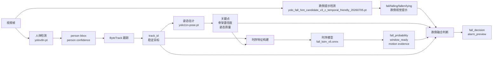

各模型的直观作用：

| 模型/模块 | 输入 | 输出 | 核心作用 |
|---|---|---|---|
| 人体检测 YOLO | 单帧图像 | 人体框 | 找人，是后续链路基础 |
| 跌倒提示 YOLO | 单帧图像 | fall/fallen/lying 框 | 提供跌倒视觉强提示 |
| ByteTrack | 人体框 | track_id | 让同一个人跨帧保持同一身份 |
| 姿态估计 YOLO11 | 人体目标 | 关键点和骨架 | 判断姿态是否低、横、倒地 |
| ONNX LSTM | 连续特征窗口 | 跌倒概率 | 理解动作过程，不只看单帧 |
| Fusion/StateMachine | 多模型证据 | 最终跌倒状态 | 综合判断、抑制误报、触发告警 |

## 6. 实时处理链路细节

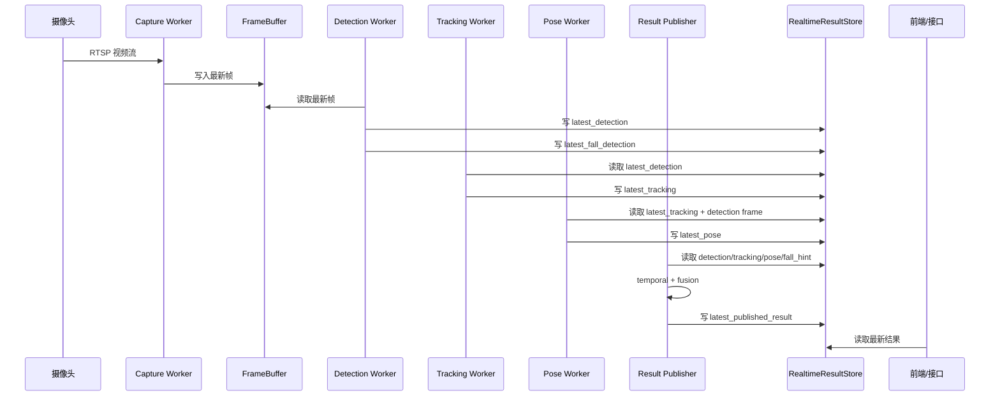

注意：这里的核心不是处理每一帧，而是尽快处理“最新帧”。实时系统里，过旧的帧即使处理完也没有太大意义。

## 7. 跌倒判定逻辑图

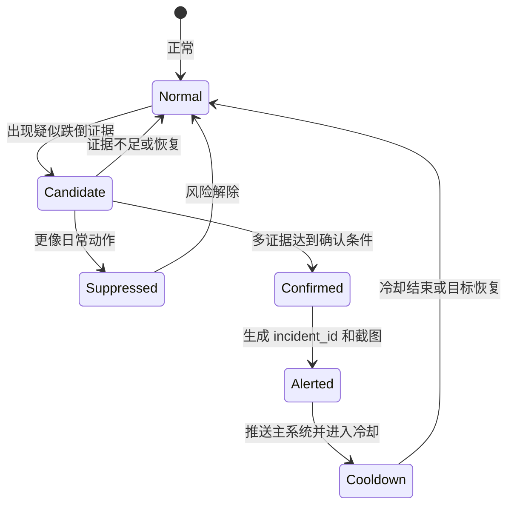

判定逻辑不是单点触发，而是多证据融合。

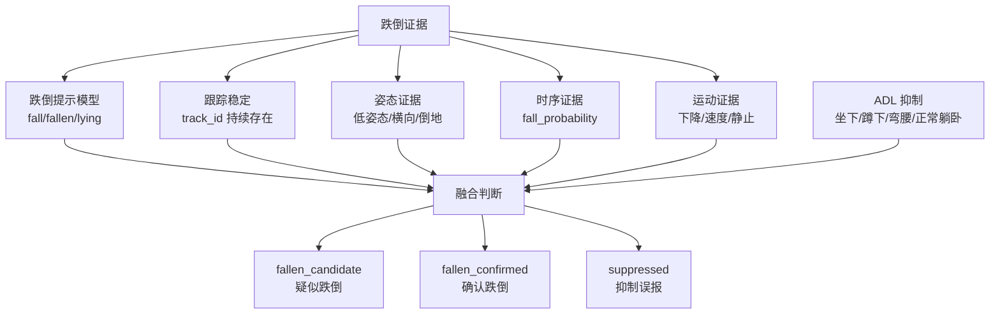

## 8. 告警闭环图

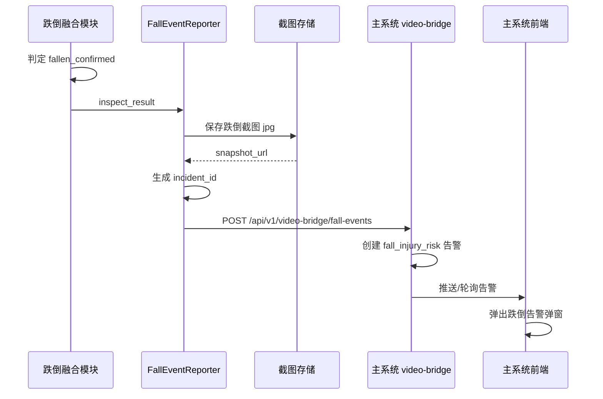

告警 payload 中最关键字段：

```text
camera_id
event_type=fall_confirmed
state=confirmed_fall
risk_level=critical
fall_prob
track_id
incident_id
bbox
snapshot_url
timestamp
injury
metadata
```

## 9. 主系统与 Vision Service 的关系

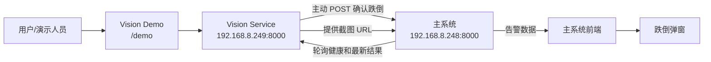

两条集成路径：

```text
路径 1: Vision 主动推送
Vision -> POST /api/v1/video-bridge/fall-events -> Main System

路径 2: 主系统主动轮询
Main System -> GET /healthz
Main System -> GET /stream/source
Main System -> GET /integration/results/camera_01/latest
```

## 10. 核心数据结构流转

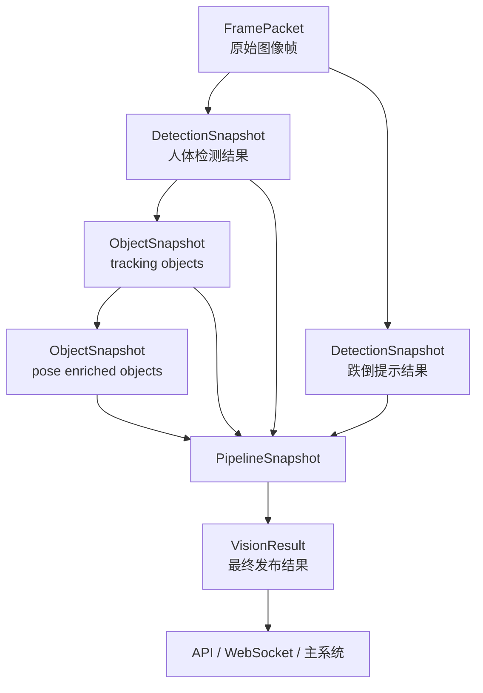

`RealtimeResultStore` 的意义：

```text
它是所有 worker 之间的共享最新结果表。
每个 worker 只负责写入自己负责的最新结果。
发布器负责把这些最新结果组装成最终 VisionResult。
```

## 11. 当前串联点和性能风险

当前系统已经有多个 worker，但仍有几个关键串联点。

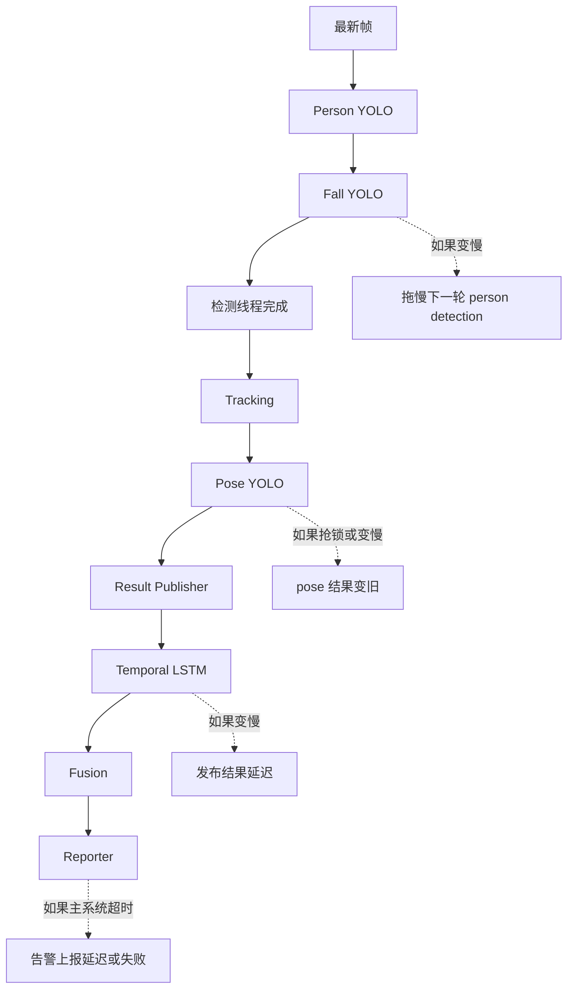

最重要的性能风险：

```text
Person YOLO 和 Fall YOLO 目前仍在 DetectionService 内部顺序执行。
Fall YOLO 一旦卡顿，会拖慢下一轮人体检测。
```

另一个风险：

```text
多个 Ultralytics 模型为了稳定性使用共享推理锁。
这避免了并发崩溃，但也会产生等待和排队。
```

## 12. 推荐的优化后链路

领导提出的优化方向，本质上应该是把系统从“局部串联模型链路”升级成“异步多模型融合链路”。

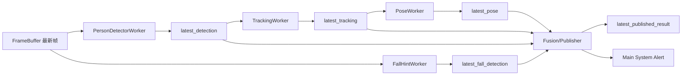

优化原则：

```text
1. 每个模型独立 worker
2. 队列长度固定为 1
3. 新帧覆盖旧帧
4. 只处理最新结果
5. 模型超时就降级
6. 融合逻辑不等待所有模型
7. 某个模型卡顿不拖死整个系统
```

## 13. 当前系统最容易向领导解释的版本

可以这样解释：

```text
我们的系统不是单一跌倒模型，而是一套实时多模型融合系统。

摄像头画面进入系统后，首先进行人体检测，找到老人位置；
然后用跟踪模块给目标生成稳定 track_id；
同时用跌倒提示模型识别画面中是否出现倒地、跌倒等视觉提示；
再用姿态模型提取人体关键点；
最后用时序模型分析连续动作变化。

系统不会只根据单帧判断跌倒，而是融合人体框、轨迹、姿态、
跌倒提示、时序概率和日常动作抑制结果。

只有当多证据达到确认条件时，才会生成 confirmed_fall，
保存截图，生成 incident_id，并推送到主系统触发弹窗。
```

## 14. 面向领导的技术价值总结

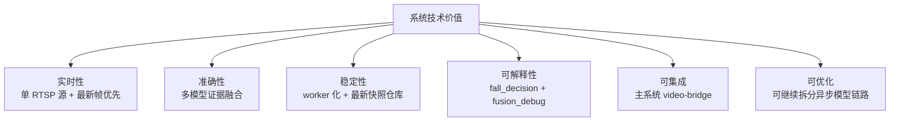

当前已经实现：

```text
实时视频接入
实时人体检测
实时跌倒提示检测
目标跟踪
姿态估计
时序跌倒分析
多证据融合
ADL 误报抑制
跌倒截图
主系统弹窗告警
前端演示页面
状态监控接口
```

下一步最建议做：

```text
把 Fall Hint Detector 从 DetectionService 中拆出，
形成独立 FallHintWorkerService。

这是降低“一个模型卡顿拖慢整体”的第一优先级改造。
```

